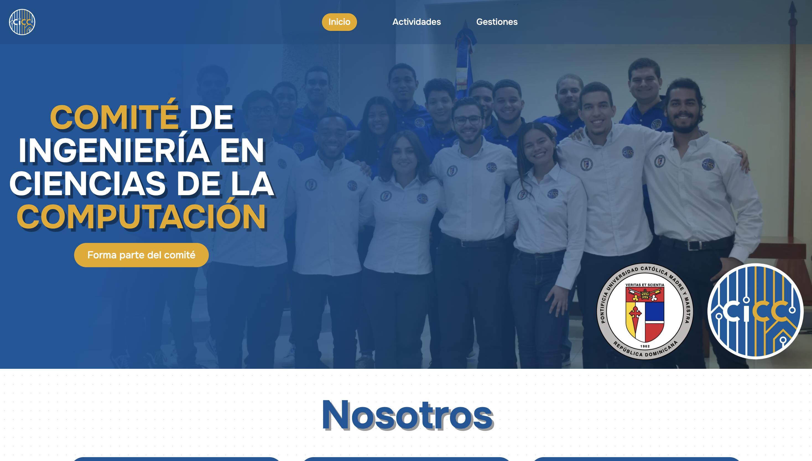
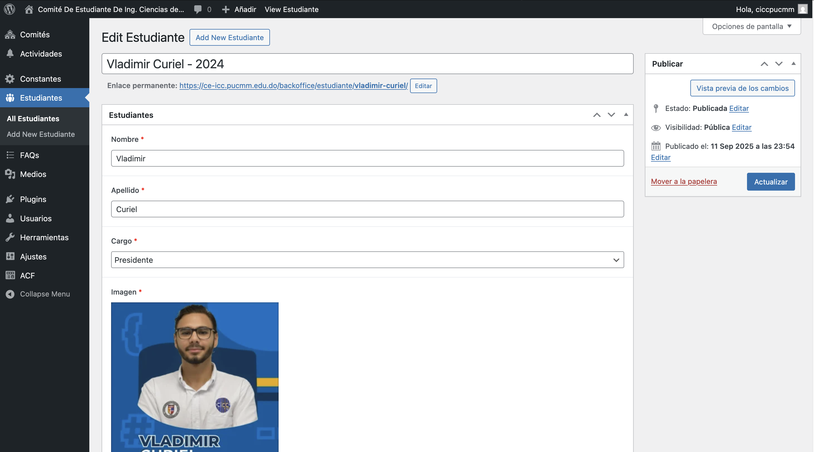
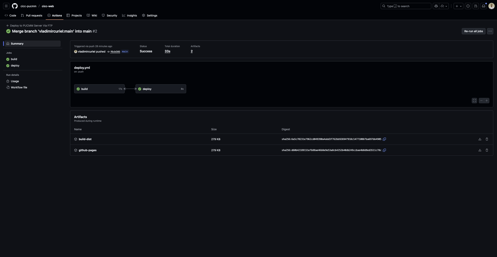

## Visitar
Para visitar la aplicación en línea, puedes hacer clic [aquí](https://ce-icc.pucmm.edu.do/) o en la imagen de arriba.

# CICC - Comité de Estudiantes de Ingeniería en Computación y Computación

[CICC](https://ce-icc.pucmm.edu.do/) es la página oficial del Comité de Estudiantes de Ingeniería en Computación y Computación de la Pontificia Universidad Católica Madre y Maestra (PUCMM). Esta plataforma sirve como un punto central para que los estudiantes accedan a información relevante, eventos y recursos relacionados con su carrera.

### Listado de funcionalidades

- Información actualizada: Proporciona información actividades, gestiones y preguntas frecuentes.

- Recursos académicos: Ofrece acceso a materiales de estudio, guías y otros recursos útiles para los estudiantes.

### Anexos

- Página de inicio

- Página de actividades

- Página de Gestiones

## CMS - Wordpress

La página consume el API REST de Wordpress para gestionar el contenido dinámico. Esto permite a los administradores del CICC actualizar fácilmente la información, agregar nuevas actividades y gestionar las gestiones sin necesidad de conocimientos técnicos avanzados.

Para estos fines, los endpoints utilizados fueron creados manualmente para ajustarse a las necesidades específicas del CICC, sin la necesidad de utilizar plugins adicionales ni de terceros.

- Wordpress

## Listado de tecnologías

- Astro
- React
- TailwindCSS
- TypeScript
- SWR
- GitHub Actions
- Wordpress

## Despliegue

Se cuenta con un flujo de trabajo en GitHub Actions para automatizar el proceso de despliegue de la aplicación. El flujo de trabajo se ejecuta cada vez que se realiza un push en la rama main del repositorio. El flujo de trabajo construye el build de la aplicación y lo despliega directamente el los servidores de la PUCMM vía FTP.

## Autor

- [Vladimir Curiel](https://vladimircuriel.com/) - Desarrollador principal

### Aclaraciones

- Mi desarrollo en este proyecto es el que queda reflejado en esta página. Durante mi presidencia en el CICC (2024-2025). La página podría haber tenido desarrollos posteriores por otros miembros del comité, los cuales no forman parte de mi trabajo y no puedo garantizar su calidad o funcionalidad.

Contactar con el CICC para más información sobre desarrollos posteriores.

- [Comité de Estudiantes de Ingeniería en Computación y Computación (CICC)](https://www.linkedin.com/in/ciccpucmm/)

## Repositorio de GitHub

::github{repo="vladimircuriel/cicc-web"}
::github{repo="cicc-pucmm/cicc-web"}

