[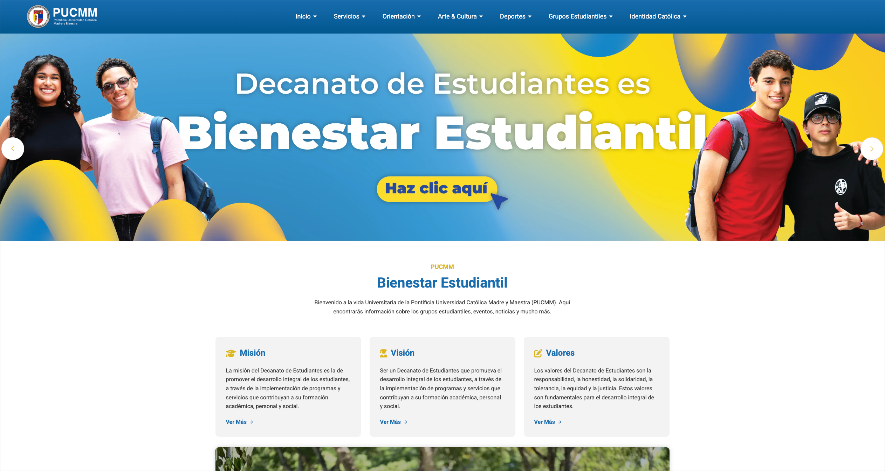](https://bienestar-estudiantil.pucmm.edu.do/)

## Visitar
Para visitar la aplicación en línea, puedes hacer clic [aquí](https://bienestar-estudiantil.pucmm.edu.do/) o en la imagen de arriba.

# Bienestar Estudiantil - PUCMM

[Bienestar Estudiantil PUCMM](https://bienestar-estudiantil.pucmm.edu.do/) es la página oficial del portal de Bienestar Estudiantil de la Pontificia Universidad Católica Madre y Maestra (PUCMM). Esta plataforma sirve como un punto central para que los estudiantes accedan a información relevante, eventos y recursos relacionados con su bienestar estudiantil.

### Listado de funcionalidades

- Información actualizada: Proporciona información sobre actividades, programas y servicios de bienestar estudiantil.

- Recursos y apoyo: Ofrece acceso a materiales y recursos útiles para el bienestar físico, emocional y académico de los estudiantes.

- Eventos y noticias: Mantiene a los estudiantes informados sobre eventos, talleres y noticias relacionadas con el bienestar estudiantil.

### Anexos

- Sección Inicial
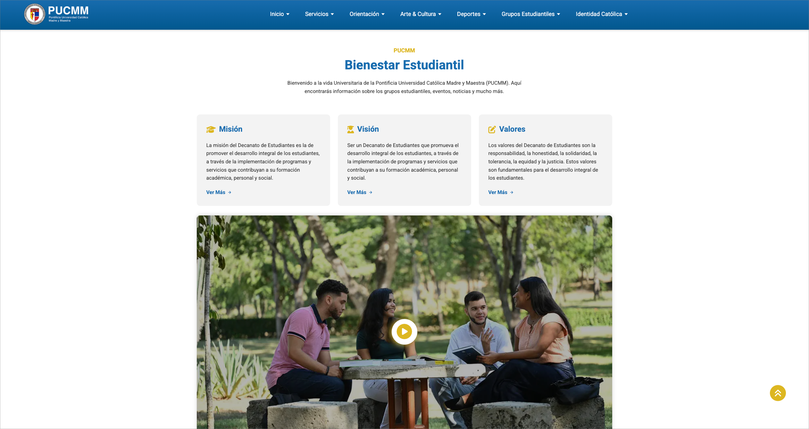

- Sección de Exploración
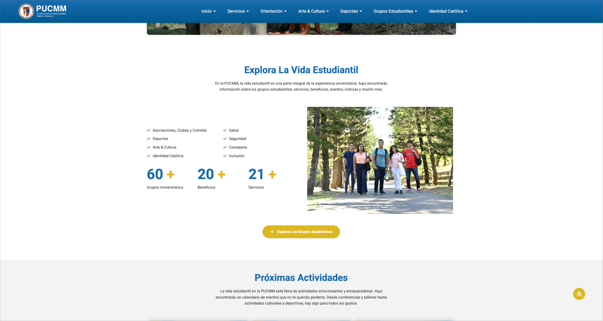

- Sección de Actividades
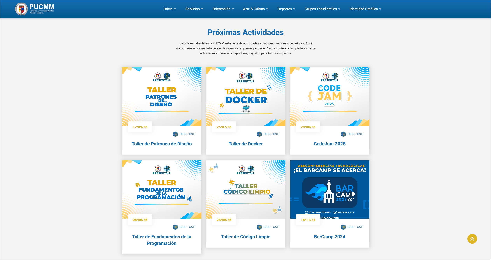

- Sección de Noticias

- Sección de YouTube
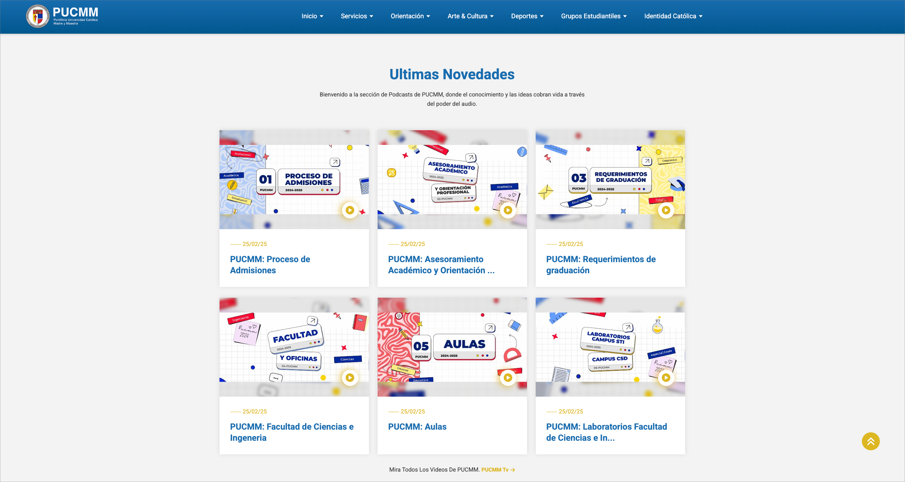

#### Paginas Relevantes

- Página del Decanato
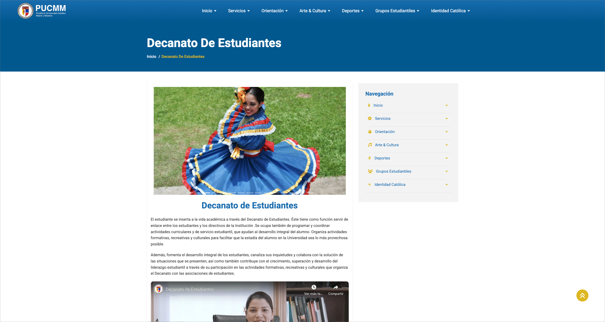

- Página de Salud
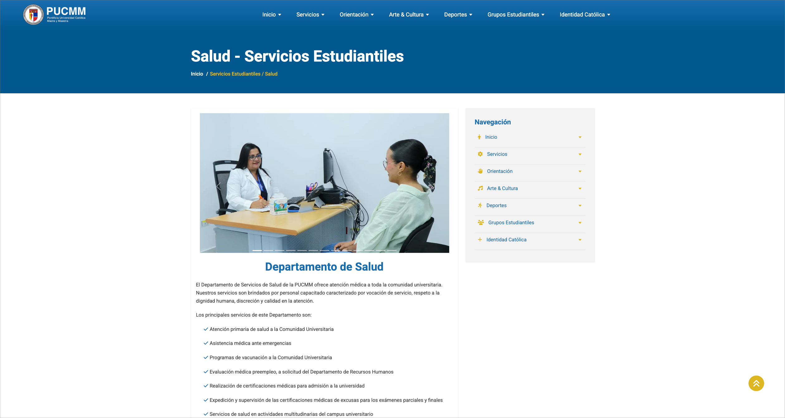

- Página de Beneficios
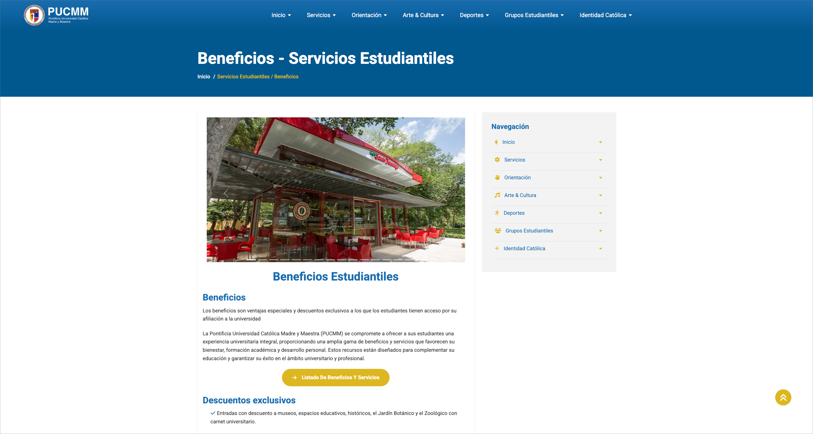

- Página de Artes
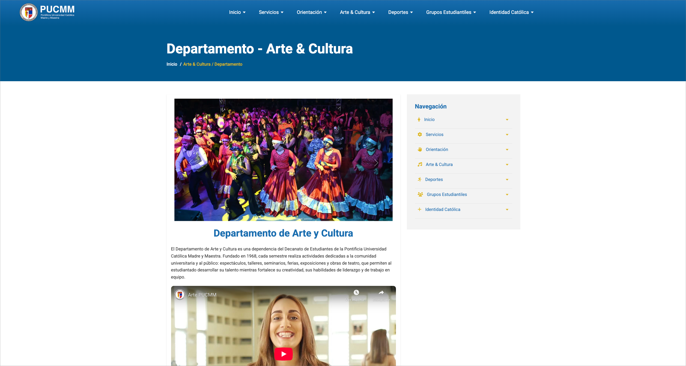

- Página de Asociaciones
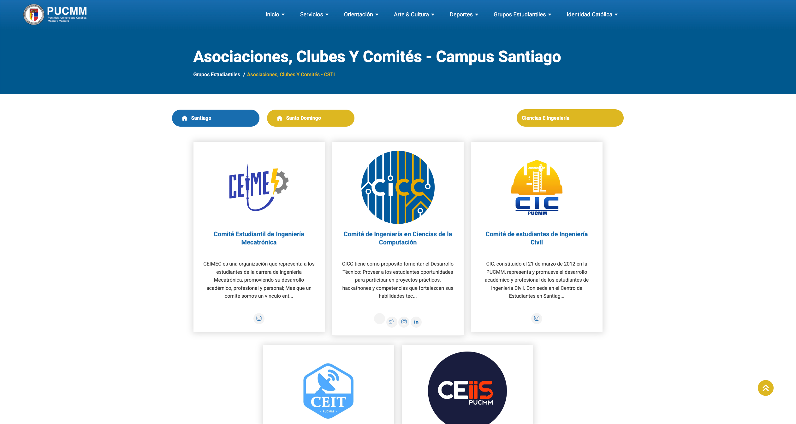

##### Ejemplo de Asociación

- Página de CICC
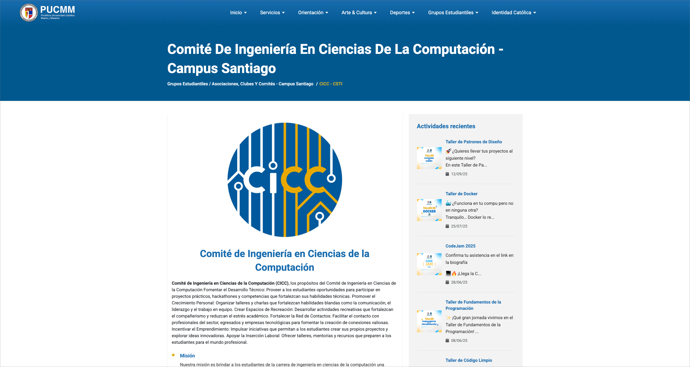

## CMS - Wordpress

La página consume el API REST de Wordpress para gestionar el contenido dinámico. Esto permite a los administradores del portal de Bienestar Estudiantil actualizar fácilmente la información, agregar nuevas actividades y gestionar las secciones sin necesidad de conocimientos técnicos avanzados.

Para estos fines, los endpoints utilizados fueron creados manualmente para ajustarse a las necesidades específicas del portal, sin la necesidad de utilizar plugins adicionales ni de terceros.

- Wordpress
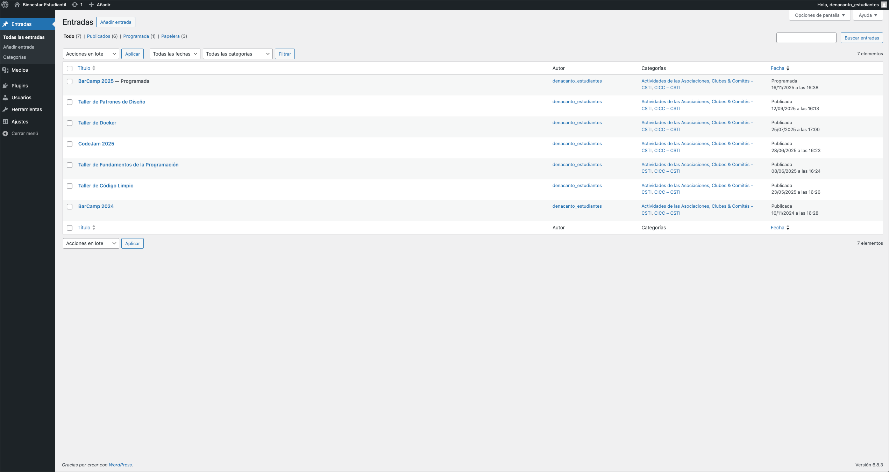

## Listado de tecnologías

- Astro
- React
- TailwindCSS
- TypeScript
- GitHub Actions
- Wordpress

## Despliegue

Se cuenta con un flujo de trabajo en GitHub Actions para automatizar el proceso de despliegue de la aplicación. El flujo de trabajo se ejecuta cada vez que se realiza un push en la rama main del repositorio. El flujo de trabajo construye el build de la aplicación y lo despliega directamente el los servidores de la PUCMM vía FTP.

## Autores

- [Vladimir Curiel](https://vladimircuriel.com/) - Desarrollador principal
- [Freddy Peña](https://fredpena.dev/) - Profesor y supervisor del proyecto

### Aclaraciones

- Mi desarrollo en este proyecto es el que queda reflejado en esta página. Durante mi tiempo como desarrollador en la PUCMM. La página podría haber tenido desarrollos posteriores por otros miembros del equipo, los cuales no forman parte de mi trabajo y no puedo garantizar su calidad o funcionalidad.