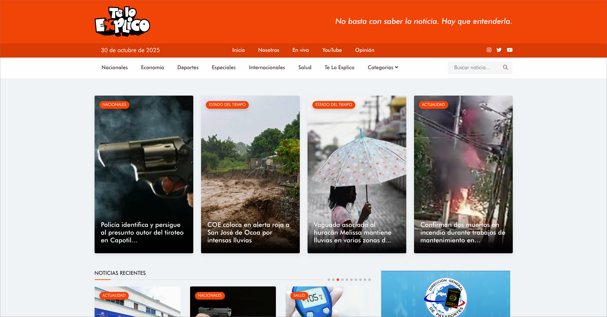
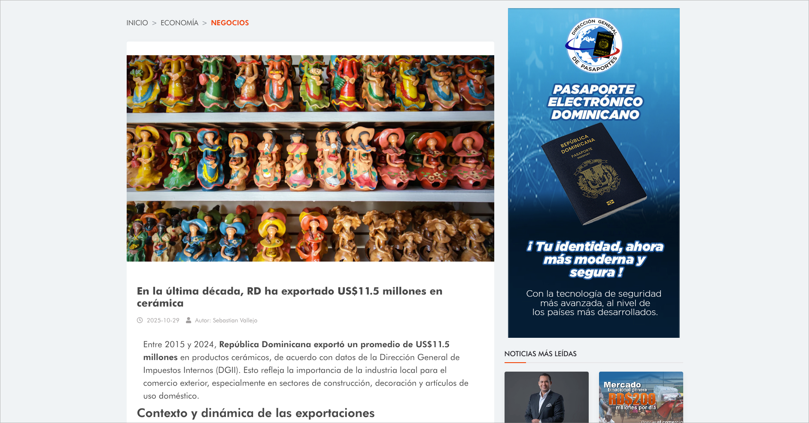
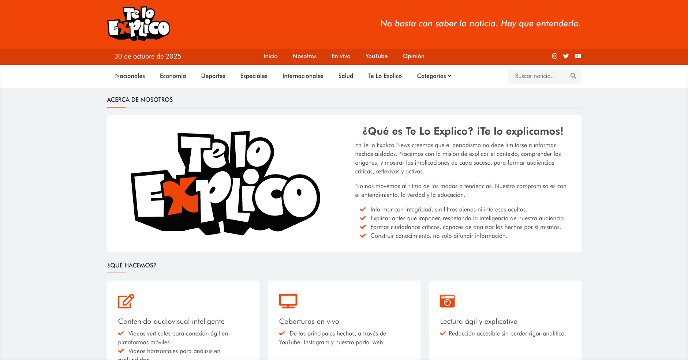
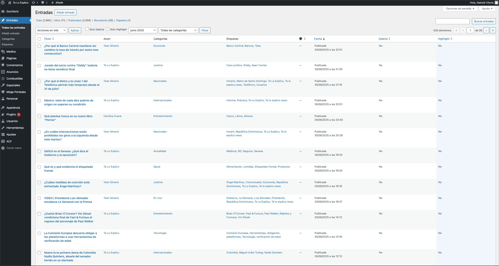
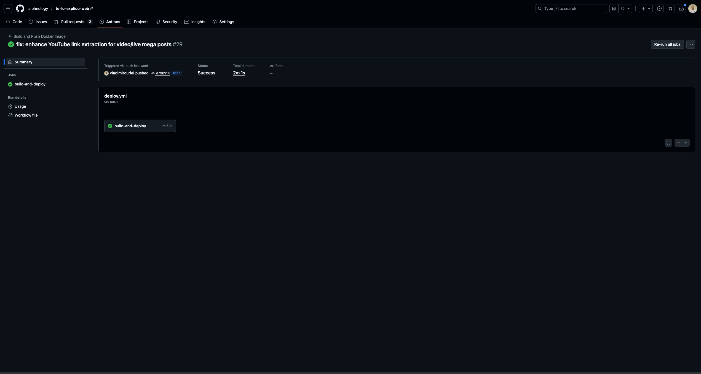

## Visitar

Para visitar la página en línea, puedes hacer clic [aquí](https://teloexplico.news/) o en la imagen de arriba.

# Te Lo Explico | Newsletter Page

[Te Lo Explico](https://teloexplico.news/) es la página oficial de la newsletter homónima. Esta plataforma sirve como un punto central para que los lectores accedan a artículos, noticias y recursos relacionados con diversos temas de interés.

### Listado de funcionalidades

- Artículos y noticias: Proporciona acceso a artículos y noticias relevantes para los lectores.

- Anuncios y promociones: Ofrece espacios para anuncios y promociones relacionadas con la newsletter.

- Monitoreo y análisis: Implementa herramientas para monitorear el tráfico y analizar el comportamiento de los usuarios en la página.

### Anexos

- Sección Inicial

- Sección de YouTube

- Página de Categorías

- Página de Noticias

- Página de Nosotros

## CMS - Wordpress

La página consume el API REST de Wordpress para gestionar el contenido dinámico. Esto permite una fácil administración de artículos, noticias y otros recursos a través del panel de administración de Wordpress. Ya sea la creación, edición o eliminación de contenido, todo se maneja de manera eficiente mediante solicitudes al API REST. El manejo de anuncios, promociones y otros elementos dinámicos también se realiza a través de este sistema.

Se tiene una integración personalizada con Wordpress para adaptar el API REST a las necesidades específicas de la página. Asimismo como el uso de Google Analytics para el monitoreo y análisis del tráfico del sitio web.

Para estos fines, los endpoints utilizados fueron creados manualmente para ajustarse a las necesidades específicas del portal, sin la necesidad de utilizar plugins adicionales ni de terceros.

- Wordpress

## Listado de Tecnologías

- Astro
- TailwindCSS
- TypeScript
- Google Analytics
- GitHub Actions
- Wordpress
- Docker
- Digital Ocean

## Despliegue

La web está desplegada en un servidor privado virtual (VPS) en DigitalOcean. Utiliza Docker para contenerizar la aplicación y la base de datos. Utiliza Traefik como proxy inverso para gestionar las solicitudes HTTP y HTTPS. Utiliza GitHub Actions para automatizar el proceso de despliegue de la aplicación y la base de datos.

### GitHub Actions

Se cuenta con un flujo de trabajo en GitHub Actions para automatizar el proceso de despliegue de la aplicación y la base de datos. El flujo de trabajo se ejecuta cada vez que se realiza un push en la rama main del repositorio. El flujo de trabajo construye las imágenes Docker de la aplicación y la base de datos, las sube a Docker Hub y despliega las imágenes en el servidor VPS en DigitalOcean.

## Autores

- [Vladimir Curiel](https://vladimircuriel.com/) - Desarrollador principal
- [Freddy Peña](https://fredpena.dev/) - Supervisor del proyecto

### Aclaraciones

Este proyecto fue realizado bajo la supervisión del Ing. Freddy Peña, quien es fundador de [Alphnology](https://alphnology.com/), empresa de soluciones tecnológicas dedicada al desarrollo de software y consultoría en tecnologías de la información. Esta página es una solución proporcionada por Alphnology para la newsletter Te Lo Explico, en la cual tuve el rol de desarrollador principal.