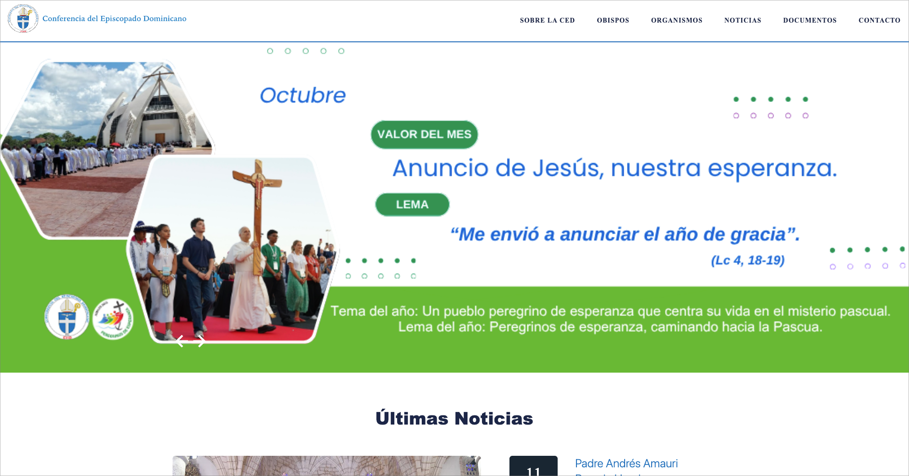
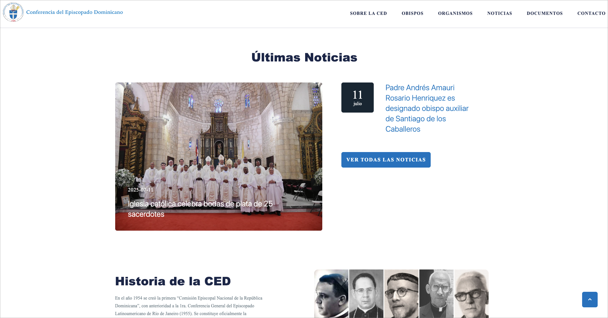
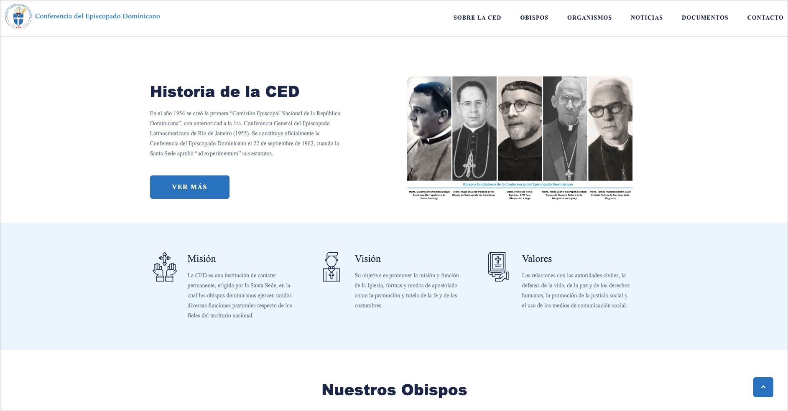
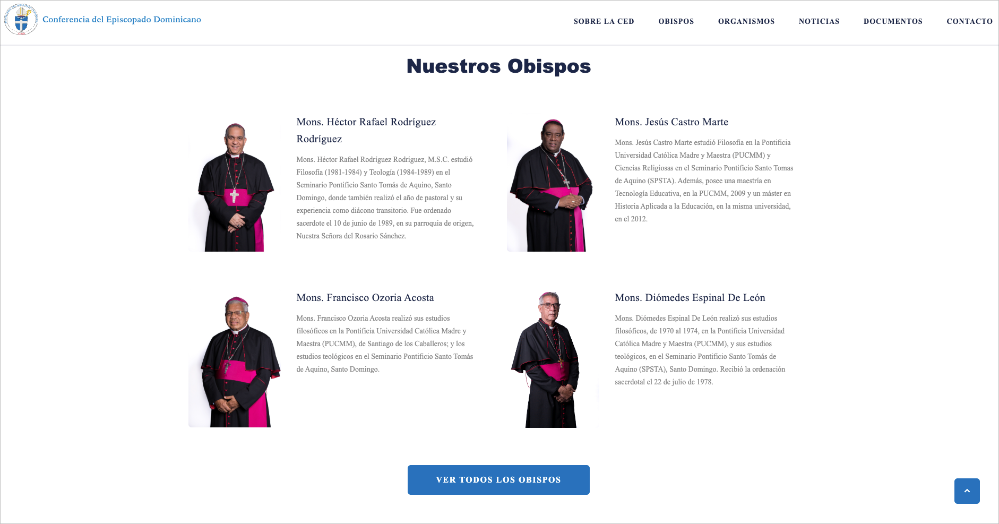
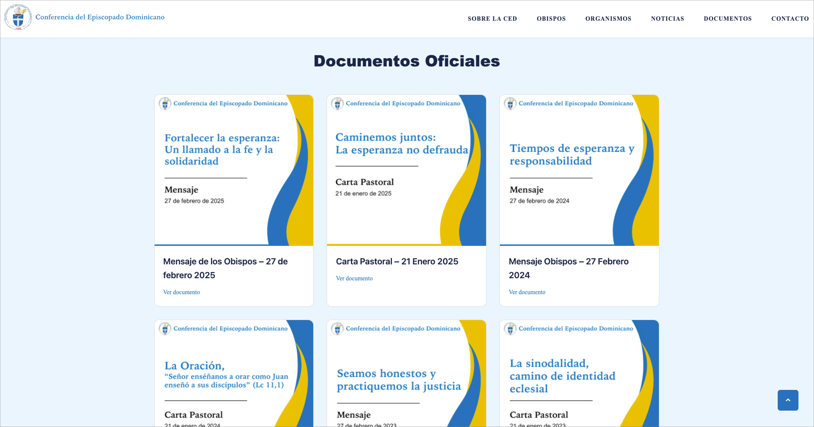
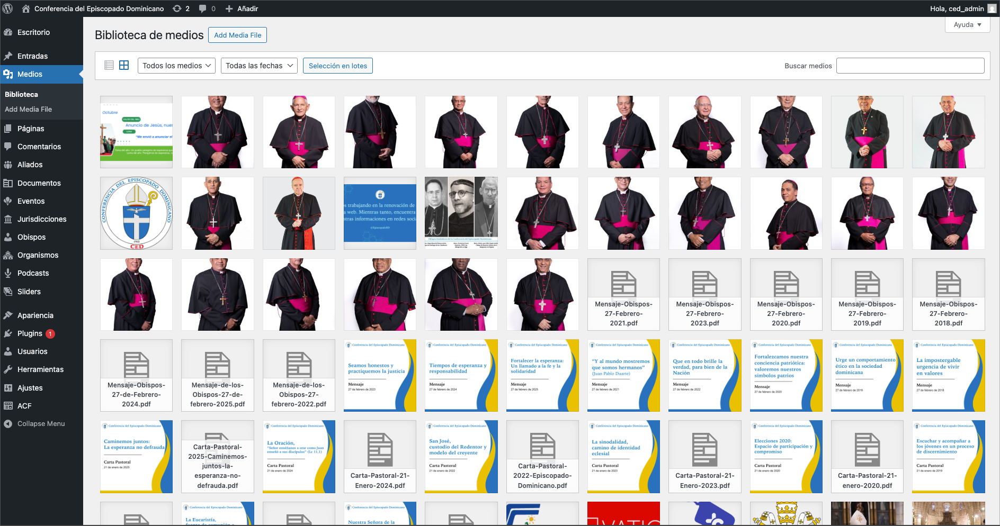

## Visitar
Para visitar la aplicación en línea, puedes hacer clic [aquí](https://ced.org.do/) o en la imagen de arriba.

# Conferencia Episcopado Dominicano | Landing Page

[Conferencia del Episcopado Dominicano (CED)](https://ced.org.do/) es la página oficial del portal de la Conferencia del Episcopado Dominicano. Esta plataforma sirve como un punto central para que los usuarios accedan a información relevante, noticias y recursos relacionados con la iglesia católica en la República Dominicana.

### Listado de funcionalidades

- Información actualizada: Proporciona información sobre actividades, programas y servicios de la iglesia católica en el país.

- Recursos y apoyo: Ofrece acceso a materiales y recursos útiles para la comunidad católica.

- Noticias y eventos: Mantiene a los usuarios informados sobre eventos, talleres y noticias relacionadas con la iglesia católica.

### Anexos

- Sección Inicial

- Sección de Historia

- Sección de Obispos

- Sección de Documentos

- Sección de Pie de Página

## CMS - Wordpress

La página consume el API REST de Wordpress para gestionar el contenido dinámico. Esto permite a los administradores del portal de CED actualizar fácilmente la información, agregar nuevas actividades y gestionar las secciones sin necesidad de conocimientos técnicos avanzados.

Para estos fines, los endpoints utilizados fueron creados manualmente para ajustarse a las necesidades específicas del portal, sin la necesidad de utilizar plugins adicionales ni de terceros.

- Wordpress

## Listado de tecnologías

- Astro
- React
- TailwindCSS
- TypeScript
- GitHub Actions
- Wordpress

## Despliegue

Se cuenta con un flujo de trabajo en GitHub Actions para automatizar el proceso de despliegue de la aplicación. El flujo de trabajo se ejecuta cada vez que se realiza un push en la rama main del repositorio. El flujo de trabajo construye el build de la aplicación y lo despliega directamente el los servidores de la PUCMM vía FTP.

## Autores

- [Vladimir Curiel](https://vladimircuriel.com/) - Desarrollador principal
- [Freddy Peña](https://fredpena.dev/) - Profesor y supervisor del proyecto

### Aclaraciones

- Este proyecto fue realizado bajo la organización de la PUCMM, dichos son los proveedores de los servidores de la web y el desarrollo de la misma. Mi desarrollo en este proyecto es el que queda reflejado en esta página. Durante mi tiempo como desarrollador en la PUCMM. La página podría haber tenido desarrollos posteriores por otros miembros del equipo, los cuales no forman parte de mi trabajo y no puedo garantizar su calidad o funcionalidad.