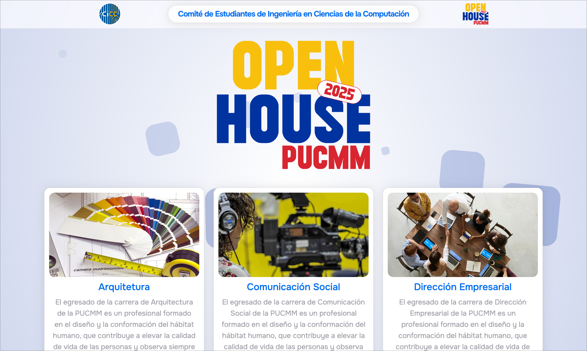

# Open House PUCMM 2025

Open House PUCMM 2025 es una página web desarrollada para el evento Open House de la Pontificia Universidad Católica Madre y Maestra (PUCMM) en el año 2025. La página web está diseñada para que los estudiantes selecciones sus carreras de interés, proporcionando información relevante sobre cada una de ellas por correo.

## Detalles de la página

Para el backend se utilizó SpringBoot, el cual se encarga de manejar la lógica de negocio, la conexión con la base de datos y el envío de correos electrónicos. Para el frontend se utilizó NextJS, el cual se encarga de mostrar la información al usuario y de enviar los datos al backend. Para el diseño de la página se utilizó TailwindCSS.

### Listado de funcionalidades

- Selección de carreras de interés por parte de los estudiantes.
- Envío de correos electrónicos con información detallada sobre las carreras seleccionadas utilizando Mailjet.

#### Anexos

<iframe width="100%" height="500" src="https://www.youtube.com/embed/FEQsLwRRamQ?si=Kc5B2Rn8wF9KdvaF" title="YouTube video player" frameborder="0" allow="accelerometer; autoplay; clipboard-write; encrypted-media; gyroscope; picture-in-picture; web-share" referrerpolicy="strict-origin-when-cross-origin" allowfullscreen></iframe>

## Listado de tecnologías utilizadas

- [SpringBoot](https://spring.io/projects/spring-boot)
- [NextJS](https://nextjs.org/)
- [TailwindCSS](https://tailwindcss.com)
- [Mailjet](https://www.mailjet.com/)
- [PostgreSQL](https://www.postgresql.org/)
- [Docker](https://www.docker.com/)
- [Docker Compose](https://docs.docker.com/compose/)

## Repositorio de GitHub

::github{repo="cicc-pucmm/OpenHouse-2025"}

## Autores

- [Vladimir Curiel](https://vladimircuriel.com/) - Co-desarrollador
- [Iván Marcelino](https://www.linkedin.com/in/ivan-marcelino-236046254/) - Co-desarrollador