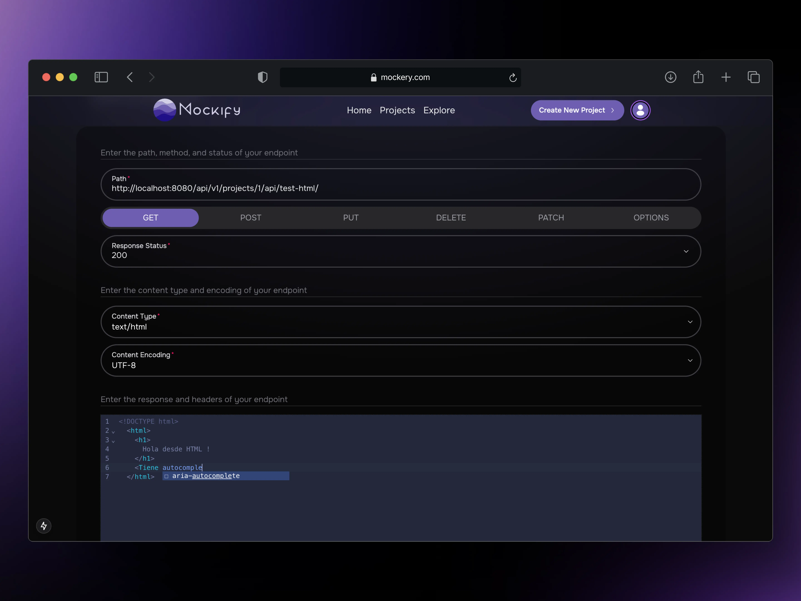
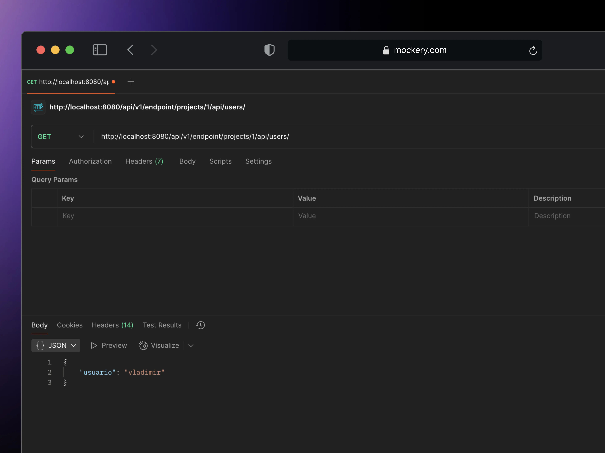
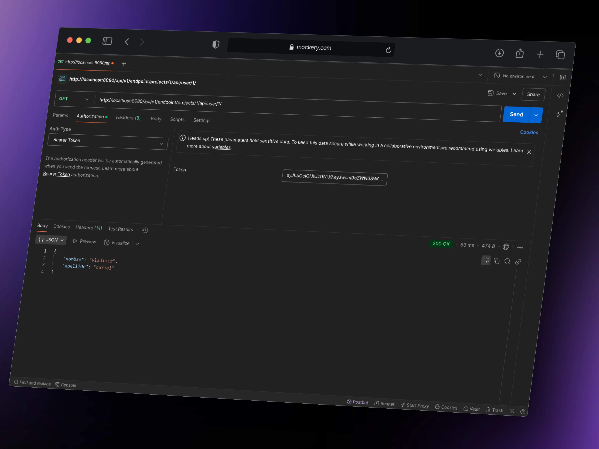
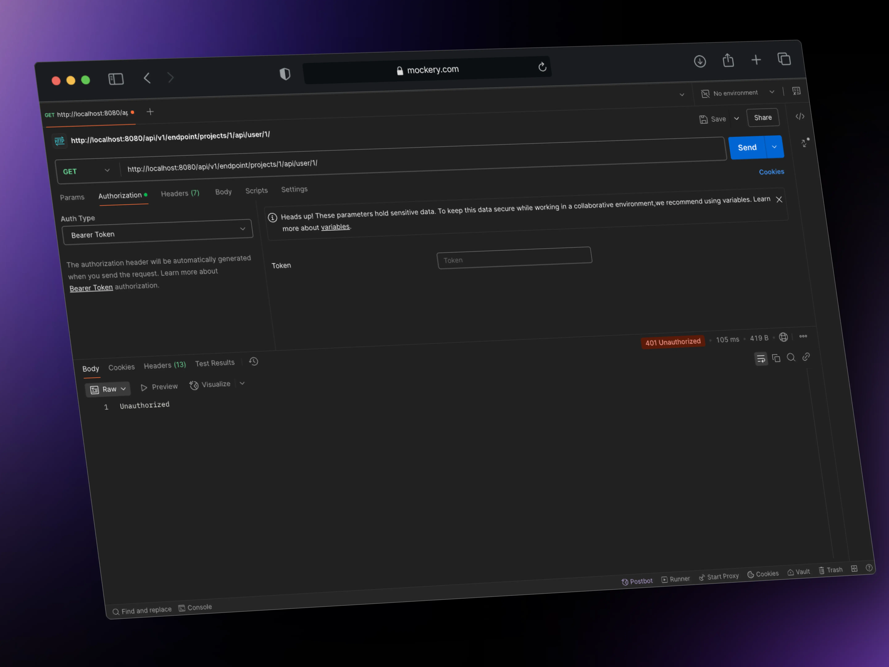
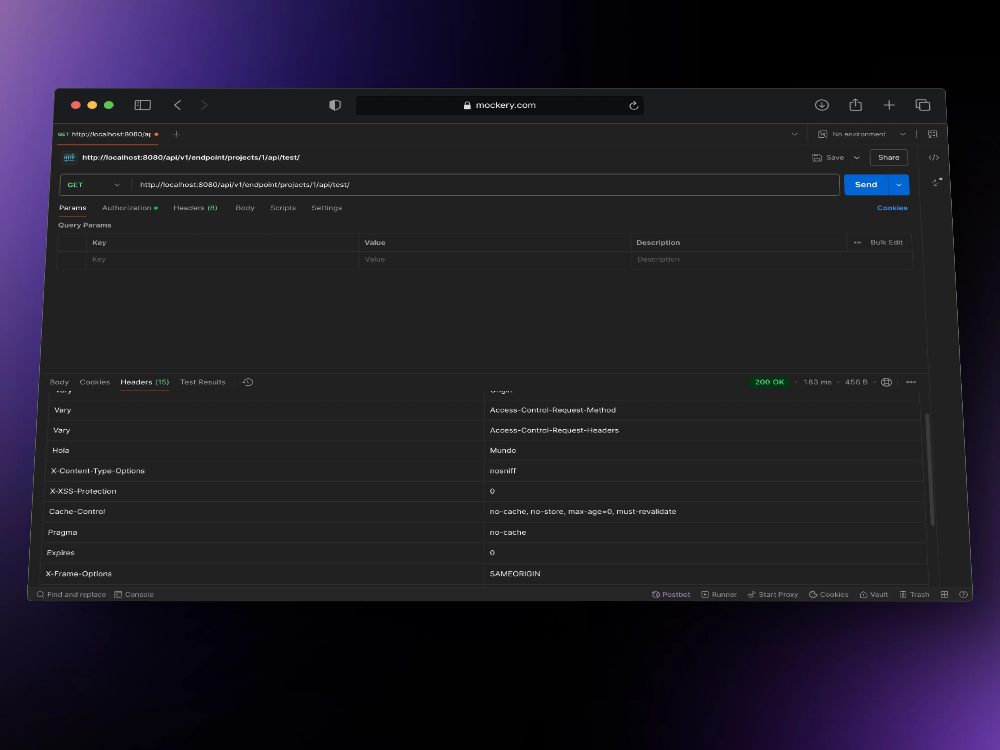
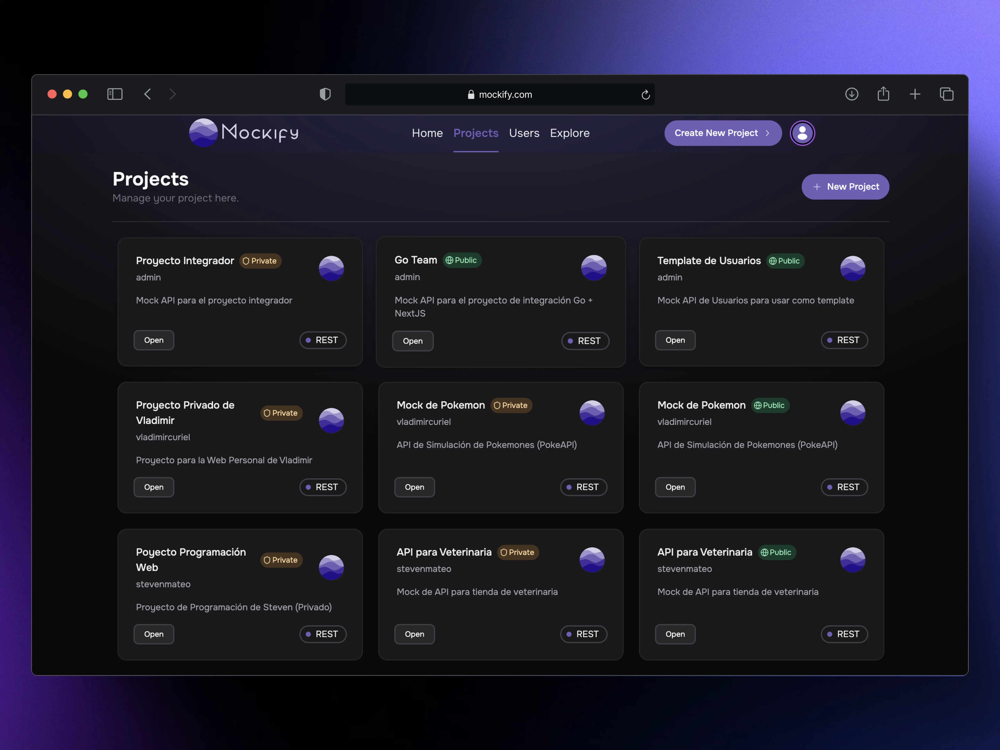
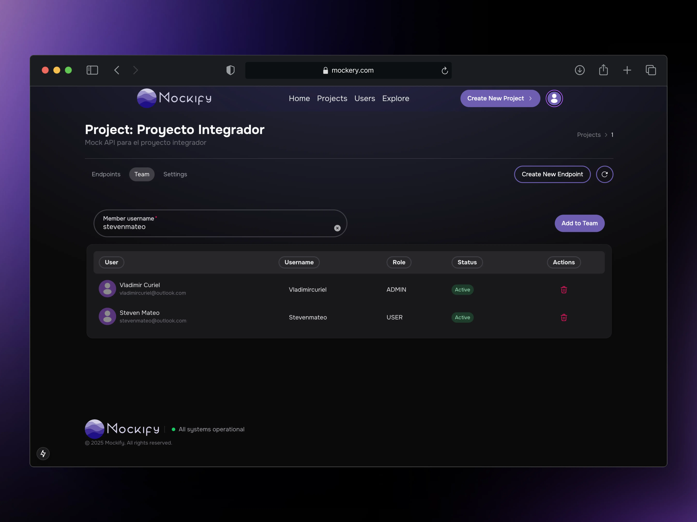
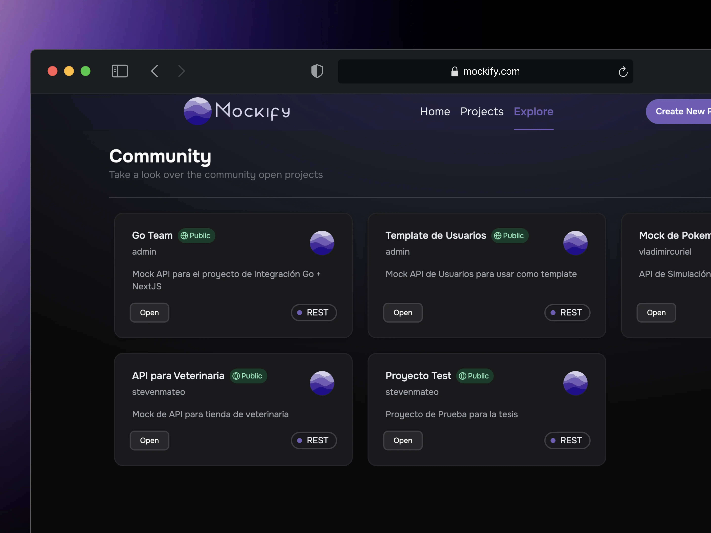
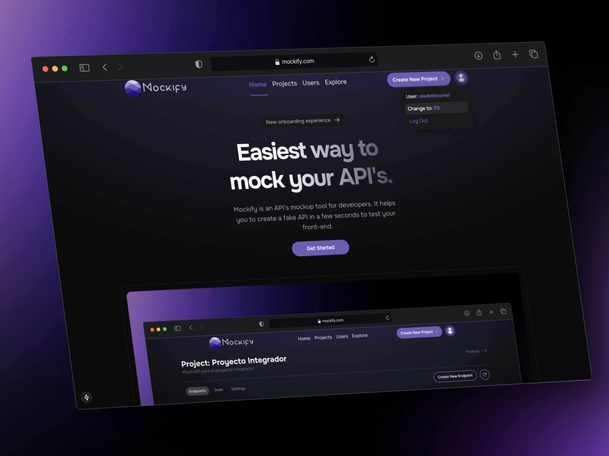

# Mockify | API Mocking Tool

Mockify es una aplicación cliente-servidor para crear y gestionar mocks de APIs REST, ideal para agilizar pruebas y desarrollo colaborativo. El servidor, construido en Spring Boot, expone endpoints configurables y balanceados, mientras que el cliente en Next.js y Tailwind CSS ofrece una interfaz limpia para administrar proyectos, mocks y usuarios.

### Listado de funcionalidades usuarios

- Crear y gestionar proyectos de mocks
- Definir endpoints REST con respuestas personalizadas, como códigos de estado, cabeceras y cuerpos
- Soporte para autenticación JWT en endpoints mockeados
- Visualización y prueba de endpoints directamente desde la interfaz web
- Interfaz intuitiva para administrar mocks y usuarios
- Colaboración en equipo mediante la gestión de miembros del proyecto
- Interfaz multilenguaje (español e inglés)

#### Anexos

- Creación de Endpoint

- Probar Endpoint

- Probar JWT

- JWT Negado

- Headers

- Proyectos

- Equipo

- Proyecto Públicos

- Cambio de Lenguaje

## Demo de la aplicación

<iframe width="100%" height="500" src="https://www.youtube.com/embed/4V_lEfckXC4?si=eabLpfq8wfBbX4Lg" title="YouTube video player" frameborder="0" allow="accelerometer; autoplay; clipboard-write; encrypted-media; gyroscope; picture-in-picture; web-share" referrerpolicy="strict-origin-when-cross-origin" allowfullscreen></iframe>

#### Alcance y limitaciones

- La aplicación está diseñada para mockear APIs REST, por lo que no soporta otros tipos de APIs como GraphQL o SOAP.
- La autenticación JWT es básica y puede no cubrir todos los casos de uso avanzados.
- La aplicación no incluye funcionalidades avanzadas de monitoreo o logging de las solicitudes a los endpoints mockeados.
- La interfaz web está optimizada para escritorio, con limitaciones en dispositivos móviles.
- La aplicación no soporta la importación/exportación de configuraciones de mocks en formatos estándar como OpenAPI o Postman.

## Tecnologías utilizadas

- [Spring Boot](https://spring.io/projects/spring-boot)
- [Redis](https://redis.io/)
- [PostgreSQL](https://www.postgresql.org/)
- [Java](https://www.java.com/)
- [NextJS](https://nextjs.org/)
- [TailwindCSS](https://tailwindcss.com/)
- [React](https://react.dev/)
- [JavaScript](https://developer.mozilla.org/en-US/docs/Web/JavaScript)
- [TypeScript](https://www.typescriptlang.org/)
- [Docker](https://www.docker.com/)

## Autores

- [Vladimir Curiel](https://vladimircuriel.com/) - Co-desarrollador
- [Steven Mateo](https://www.linkedin.com/in/steven-manuel-mateo-ramos-6626152b2/) - Co-desarrollador

### Repositorio de GitHub

::github{repo="vladimircuriel/mockify"}