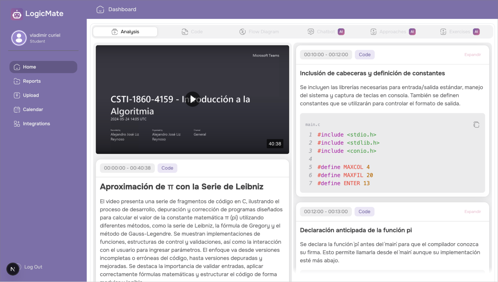

# LogicMate | AI Educational Assistant Bot

LogicMate es un bot de asistencia educativa basado en inteligencia artificial para analizar, clasificar y explicar programas de algoritmos y diagramas de programación a partir de clases virtuales. El sistema procesa grabaciones completas de sesiones académicas, segmenta el contenido relevante y utiliza modelos de visión por computadora, OCR y LLMs para interpretar código y diagramas de flujo, generando explicaciones estructuradas y contextualizadas alineadas con el contenido oficial de la asignatura Introducción a la Algoritmia.

### Listado de funcionalidades usuarios

- Vincular cuentas docentes con plataformas de videoconferencia para acceder a grabaciones de clases
- Recolectar y procesar automáticamente sesiones virtuales de Introducción a la Algoritmia
- Identificar y segmentar escenas relevantes que contengan código y diagramas de programación
- Detectar y clasificar bloques de código de algoritmos y diagramas de flujo en los videos
- Extraer texto de código y diagramas mediante OCR especializado
- Generar explicaciones automáticas y contextualizadas de códigos y diagramas usando inteligencia artificial
- Consultar informes estructurados por clase, escena y tipo de contenido
- Acceder a explicaciones didácticas alineadas con el contenido oficial de la asignatura
- Visualizar ejemplos, reconstrucciones y análisis del código presentado en clase
- Permitir a estudiantes revisar el contenido procesado de forma organizada e interactiva
- Gestionar usuarios y permisos entre roles de docente y estudiante
- Almacenar y consultar el historial de clases procesadas evitando reprocesamientos

#### Anexos

- Pantalla principal del sistema  
Vista general de LogicMate una vez autenticado el usuario. Desde esta pantalla se puede acceder a las funcionalidades principales del bot, consultar clases procesadas y navegar por los distintos módulos disponibles.

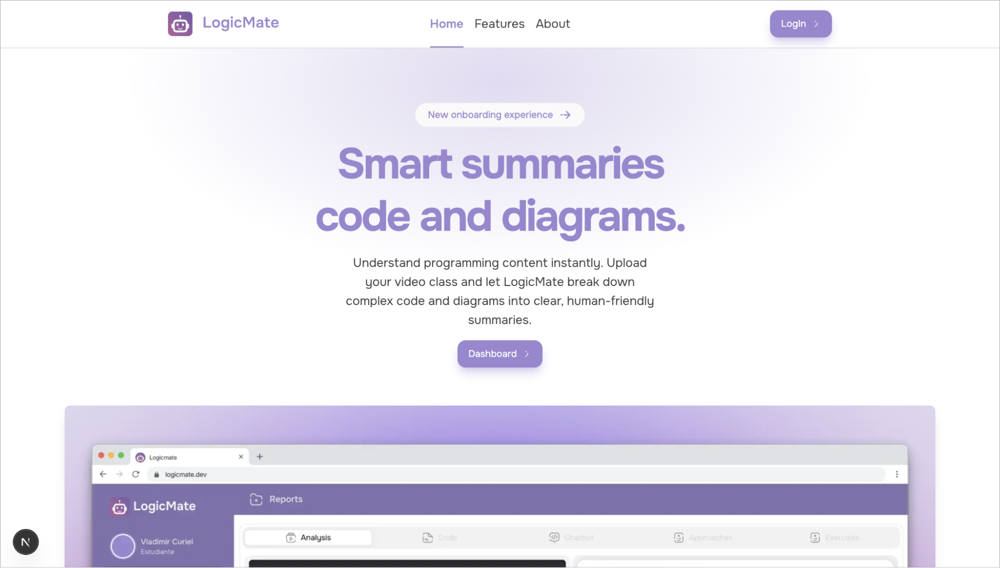

- Autenticación de usuarios  
Pantalla de inicio de sesión donde docentes y estudiantes acceden al sistema utilizando sus credenciales. Este módulo gestiona roles y permisos según el tipo de usuario.

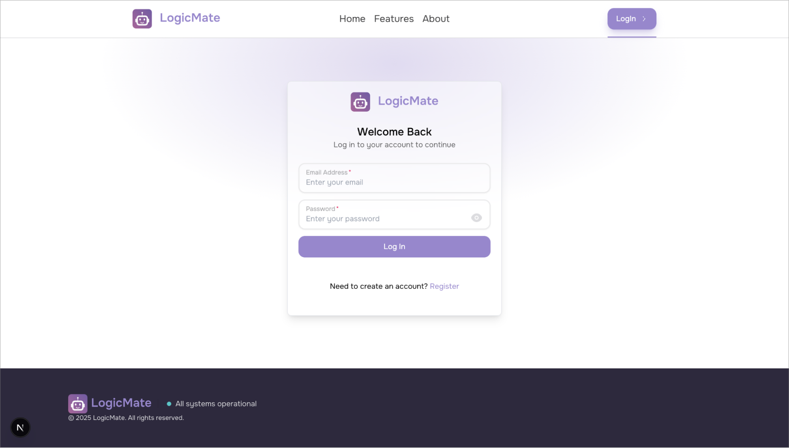

- Carga de sesiones virtuales  
Interfaz destinada a la subida manual de grabaciones o a la validación de sesiones obtenidas desde plataformas de videoconferencia. Aquí se inicia el procesamiento por parte del bot.

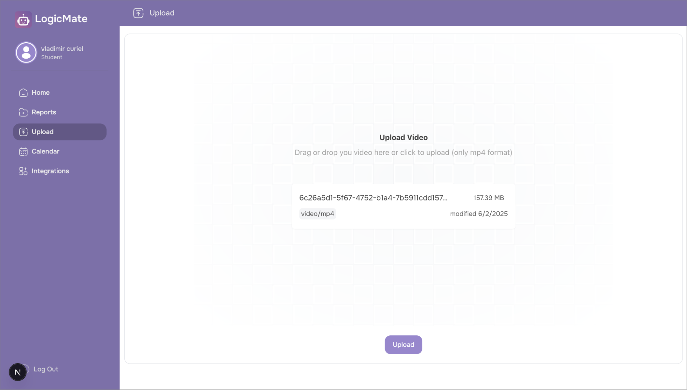

- Proceso de carga y estado del análisis  
Vista que muestra el estado de la subida y el progreso inicial del procesamiento del video, indicando que el contenido ha sido enviado correctamente a la cola de tareas.

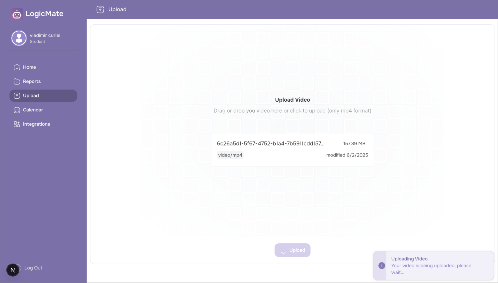

- Detección de código de algoritmos  
Proceso de subida del video a la plataforma de análisis, donde se identifican y extraen fragmentos de código relevantes para su posterior interpretación.

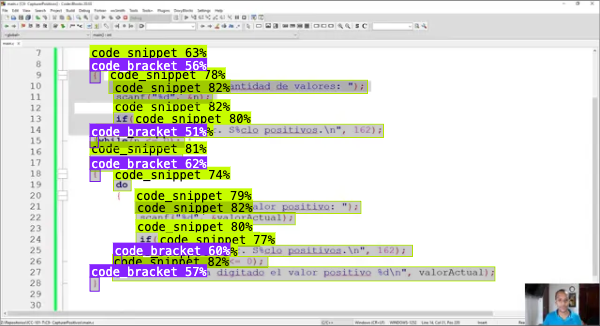

- Análisis de código de algoritmos  
Vista detallada del contenido de código detectado, donde se muestran los fragmentos identificados que luego serán interpretados y explicados por el sistema.

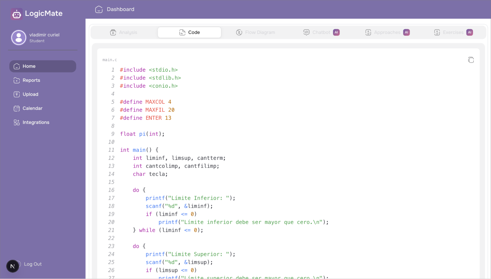

- Detección de diagramas de flujo  
Identificación automática de diagramas de programación dentro de las sesiones, destacando nodos, flechas y estructuras relevantes para su clasificación.

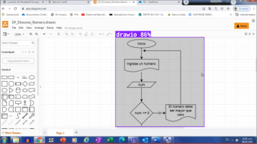

- Detección de nodos y componentes  
Vista enfocada en la detección de nodos individuales dentro de los diagramas de flujo, permitiendo una interpretación más precisa de la lógica representada.

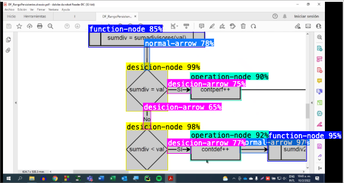

- Generación de reportes  
Pantalla donde se presentan los informes generados automáticamente por el bot, incluyendo explicaciones, reconstrucciones y análisis del contenido procesado.

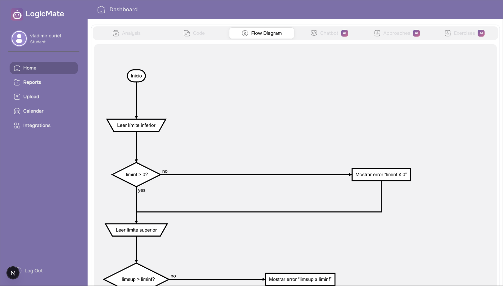

- Clasificación de diagramas Draw.io  
Resultado específico de la detección de diagramas creados en Draw.io, diferenciándolos de otros tipos de diagramas mediante modelos de visión artificial.

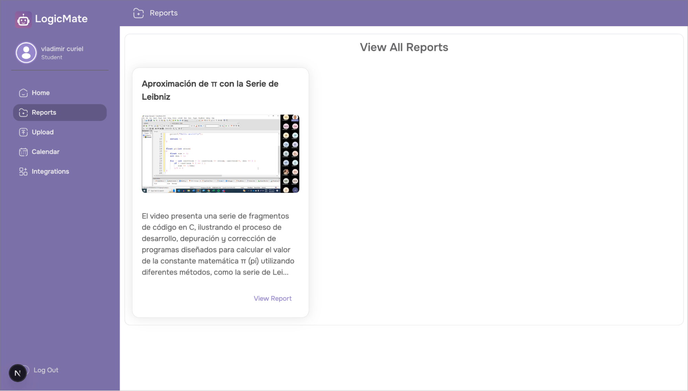

- Análisis y explicación con IA  
Sección donde se muestran las explicaciones generadas por los modelos de lenguaje, integrando código, diagramas y contexto de la clase de forma estructurada.

- Enfoques y soluciones alternativas  
Vista que presenta aproximaciones similares, ejemplos alternativos y explicaciones complementarias generadas para reforzar el aprendizaje.

- Ejercicios generados automáticamente  
Módulo donde el sistema propone ejercicios relacionados con el contenido detectado en la clase, permitiendo a los estudiantes practicar los conceptos explicados.

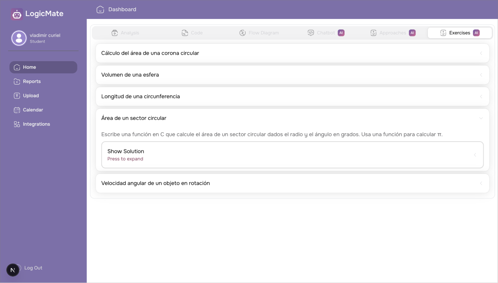

- Asistente conversacional  
Interfaz del chatbot que permite a los estudiantes interactuar con LogicMate para realizar consultas específicas sobre el contenido de las clases procesadas.

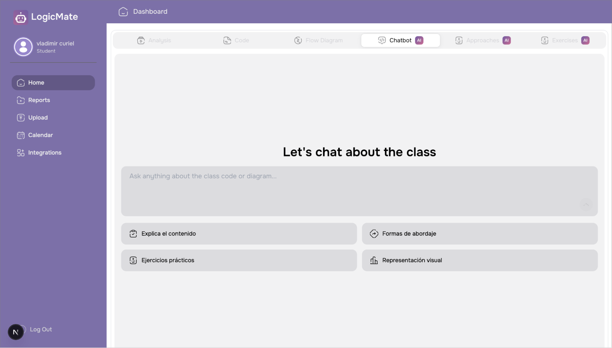

- Integración con calendario  
Vista que muestra la integración con el calendario académico, permitiendo asociar sesiones procesadas a fechas y eventos específicos.

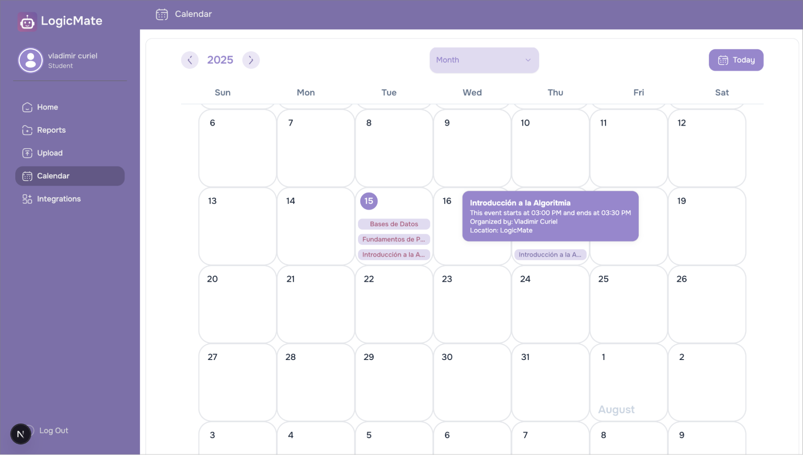

## Demo de la aplicación

<iframe width="100%" height="500" src="https://www.youtube.com/embed/txl8g-Pq3f4?si=qgn8qrxEXzVS2Crh" title="LogicMate Demo" frameborder="0" allow="accelerometer; autoplay; clipboard-write; encrypted-media; gyroscope; picture-in-picture; web-share" referrerpolicy="strict-origin-when-cross-origin" allowfullscreen></iframe>

## Documento detallado del proyecto

<object data="/proyecto_de_grado.pdf" type="application/pdf" width="100%" height="1000">
  <a href="./proyecto_de_grado.pdf">Documento del proyecto (PDF)</a>
</object>

#### Alcance y limitaciones

- El bot está diseñado exclusivamente para analizar y explicar programas de algoritmos y diagramas de programación, por lo que no procesa otros tipos de contenido académico presentes en las clases.
- El sistema está limitado a la asignatura Introducción a la Algoritmia y no se aplica a otras materias o dominios sin ajustes y reentrenamiento adicionales.
- La precisión del análisis depende directamente de la calidad de las grabaciones; videos con baja resolución, mala iluminación o texto poco legible pueden afectar los resultados.
- El bot no garantiza compatibilidad automática con cambios en las APIs, políticas o formatos de las plataformas de videoconferencia integradas.
- El procesamiento de videos es intensivo en recursos, por lo que los tiempos de análisis pueden variar según la duración del material y la capacidad de cómputo disponible.
- La extracción de texto mediante OCR puede presentar errores en códigos complejos, tipografías poco estándar o diagramas con alta densidad visual.
- El sistema no procesa audio ni explicaciones verbales, basándose únicamente en el contenido visual de las grabaciones.
- El cumplimiento de normativas de privacidad y protección de datos limita el acceso, almacenamiento y reutilización de las grabaciones procesadas.

## Tecnologías utilizadas

- [Python](https://www.python.org/)
- [PySceneDetect](https://www.scenedetect.com/)
- [YOLOv12](https://github.com/ultralytics/ultralytics)
- [Roboflow](https://roboflow.com/)
- [DINOv2](https://ai.facebook.com/blog/dino-v2-self-supervised-learning/)
- [Hugging Face Transformers](https://huggingface.co/docs/transformers)
- [Surya OCR](https://github.com/VikParuchuri/surya)
- [OpenAI API](https://platform.openai.com/docs)
- [FastAPI](https://fastapi.tiangolo.com/)
- [Celery](https://docs.celeryq.dev/)
- [Redis](https://redis.io/)
- [MongoDB](https://www.mongodb.com/)
- [React](https://react.dev/)
- [Next.js](https://nextjs.org/)
- [TypeScript](https://www.typescriptlang.org/)
- [Docker](https://www.docker.com/)
- [Microsoft Graph API](https://learn.microsoft.com/graph/)
- [Microsoft Teams](https://www.microsoft.com/microsoft-teams)

## Autores

- [Vladimir Curiel](https://vladimircuriel.com/) - Co-desarrollador
- [Natasha Lopez](https://www.linkedin.com/in/natasha-lop-b22845337/) - Co-desarrolladora
- [Lisibonny Beato](https://www.linkedin.com/in/lisibonnybeato/) - Asesora Académica del Proyecto