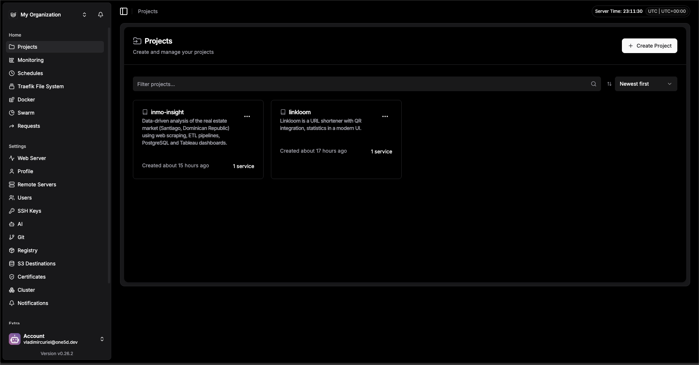
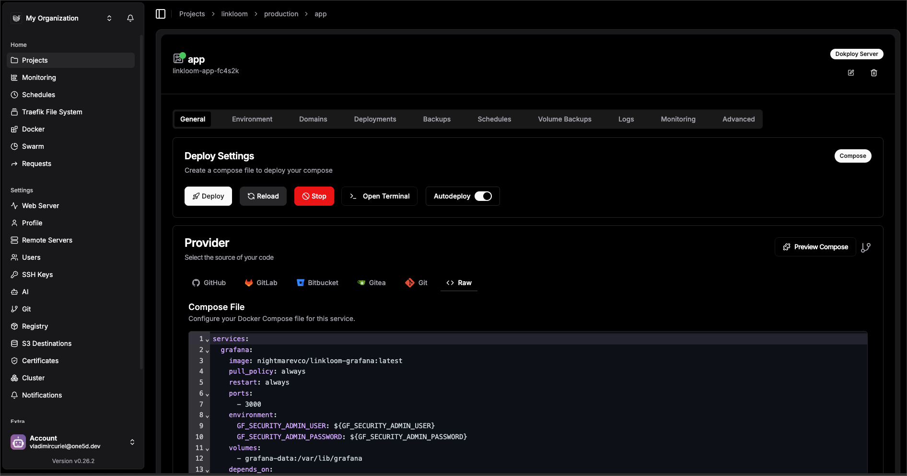
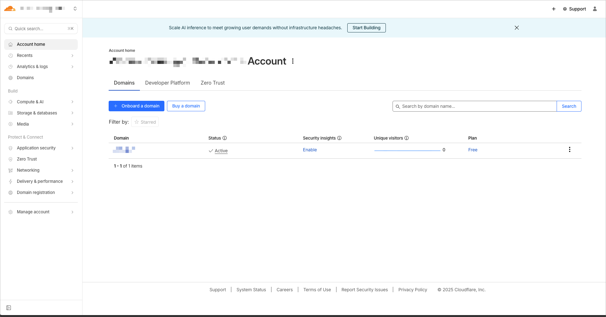
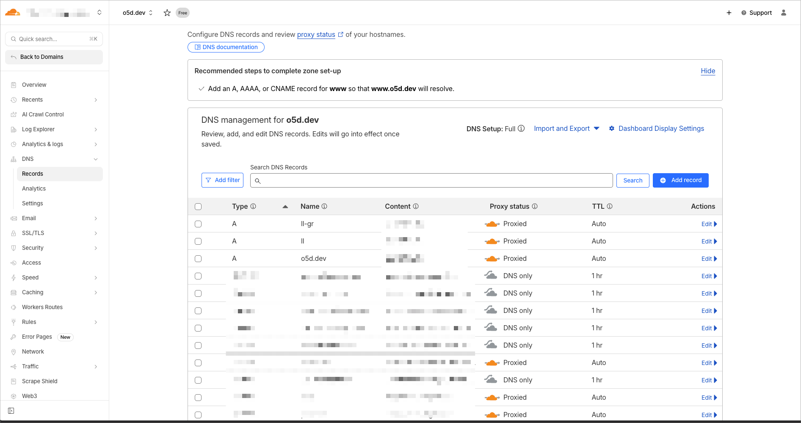
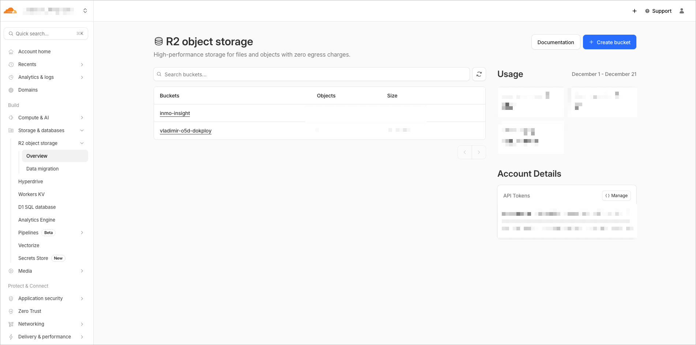
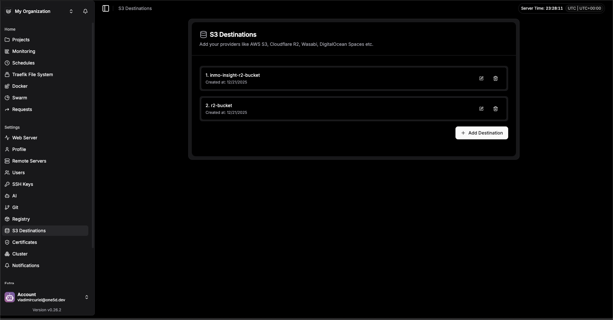

# Infrastructure Migration and Private Networking

En esta ocasión, llevé a cabo una reorganización completa de la infraestructura tecnológica que soporta algunos de mis proyectos. Se basó en la iniciativa de tener mi propia plataforma para desplegar aplicaciones y servicios (tipo vercel o netlify, que ofrecen despliegue automático y escalabilidad, monitoreo) pero con mayor control (libre de costos por suscripción, solo la VPS) y personalización. Al mismo tiempo, implementar una forma de tener conectividad segura entre mis dispositivos y servidores mediante una red privada.

## Dokploy: Plataforma de Despliegue Auto-alojada

[Dokploy](https://dokploy.com/) es una plataforma de despliegue auto-alojada, de código abierto, que permite gestionar y desplegar aplicaciones web, bases de datos, asistentes de IA y otros servicios open source de manera sencilla. Esta permite configurar despliegues automáticos desde repositorios Git, GitHub, Bitbucket, Gitea, Git, Docker o un Docker Compose, gestionar dominios personalizados, certificados SSL (usa Traefik de fondo) y monitorear el estado de las aplicaciones desplegadas, logs, configurar backups automáticos y escalabilidad.

### Características principales de Dokploy

- **Despliegue Automático**: Integración con repositorios Git para despliegues automáticos al hacer push en ramas específicas.
- **Soporte para Múltiples Tecnologías**: Compatible con aplicaciones, Docker, Docker Compose, bases de datos y asistentes de IA.
- **Gestión de Dominios y SSL**: Configuración sencilla de dominios personalizados y certificados SSL gratuitos mediante Let's Encrypt.
- **Monitoreo y Logs**: Panel de control para monitorear el estado de las aplicaciones y acceder a logs en tiempo real, terminal de contenedores y más.
- **Escalabilidad**: Opciones para escalar aplicaciones según la demanda, tanto vertical como horizontalmente (se pueden tener varios vps, de hosting diferentes y todos conectados como clústeres via Docker Swarm).
- **Backups Automáticos**: Configuración de backups regulares para asegurar la integridad de los datos (ya sea de las aplicaciones, bases de datos o de Dokploy mismo).

## Tailscale: Red Privada Segura

[Tailscale](https://tailscale.com/) es una solución de red privada virtual (VPN) basada en WireGuard que facilita la creación de redes privadas seguras entre dispositivos. Permite conectar computadoras, servidores y otros dispositivos a través de una red privada, sin necesidad de configurar complejas reglas de firewall o VPN tradicionales.

### Beneficios de usar Tailscale

- **Fácil Configuración**: Instalación y configuración rápida en múltiples dispositivos sin necesidad de conocimientos avanzados en redes.
- **Seguridad**: Utiliza el protocolo WireGuard, conocido por su seguridad y eficiencia.
- **Acceso Remoto**: Permite acceder a dispositivos y servicios de manera segura desde cualquier lugar.
- **Red Privada**: Crea una red privada entre dispositivos, aislada del tráfico público de Internet.
- **Compatibilidad Multiplataforma**: Disponible para Windows, macOS, Linux, iOS y Android.
- **Gestión Centralizada**: Panel de control para gestionar dispositivos, usuarios y permisos dentro de la red privada.

## Cloudflare para DNS y Seguridad

Utilicé [Cloudflare](https://www.cloudflare.com/) para gestionar el DNS de mis dominios, aprovechando sus servicios de seguridad y rendimiento. Cloudflare ofrece protección contra ataques DDoS, optimización del rendimiento mediante su red de distribución de contenido (CDN) y gestión sencilla de registros DNS.

### Ventajas de usar Cloudflare

- **Protección DDoS**: Defensa automática contra ataques de denegación de servicio distribuido.
- **CDN**: Mejora la velocidad de carga de sitios web mediante la distribución de contenido a través de su red global.
- **Gestión de DNS**: Interfaz intuitiva para gestionar registros DNS con alta disponibilidad.
- **SSL/TLS**: Configuración sencilla de certificados SSL para asegurar las conexiones.
- **Firewall de Aplicaciones Web**: Reglas personalizables para proteger aplicaciones web contra amenazas comunes.

### Cloudflare R2 Storage

Además, implementé [Cloudflare R2 Storage](https://www.cloudflare.com/r2/), un servicio de almacenamiento de objetos compatible con S3 que permite almacenar y servir grandes cantidades de datos sin costos de salida. Esto es especialmente útil para alojar archivos estáticos, copias de seguridad y otros datos que requieren alta disponibilidad y rendimiento. Esta ofrece una capa gratuita de 10GB de almacenamiento.

#### Cloudflare R2 & Dokploy

Integré Cloudflare R2 Storage con Dokploy para crear copias de seguridad automáticas de las aplicaciones desplegadas y del mismo Dokploy como tal. Esto asegura que los datos estén protegidos y accesibles en caso de fallos o pérdidas.

