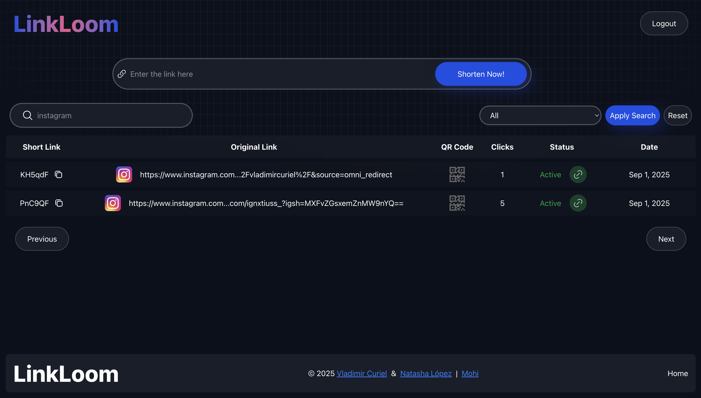
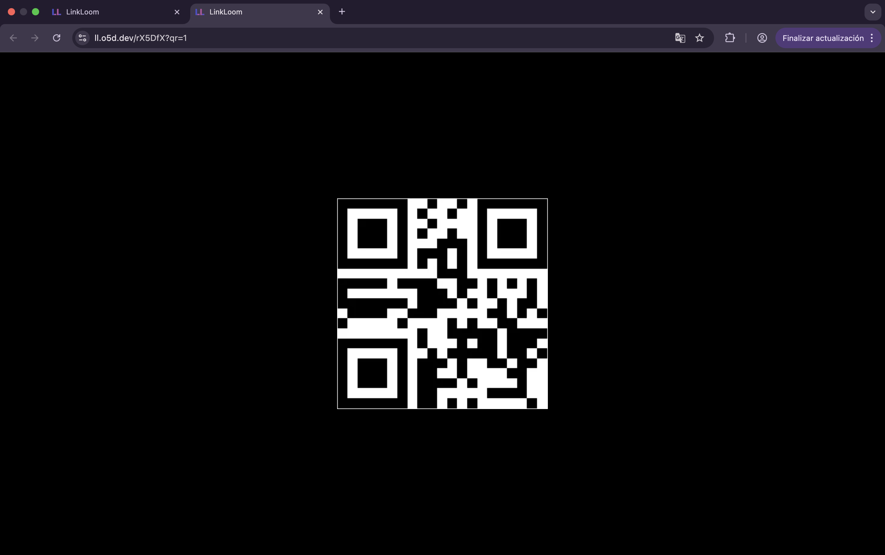
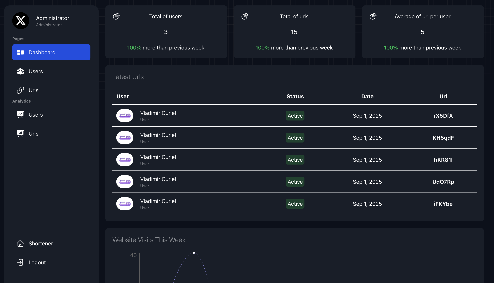
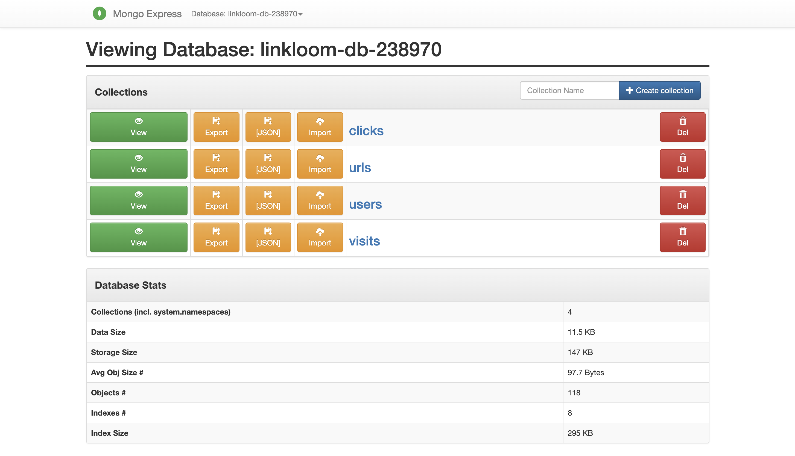
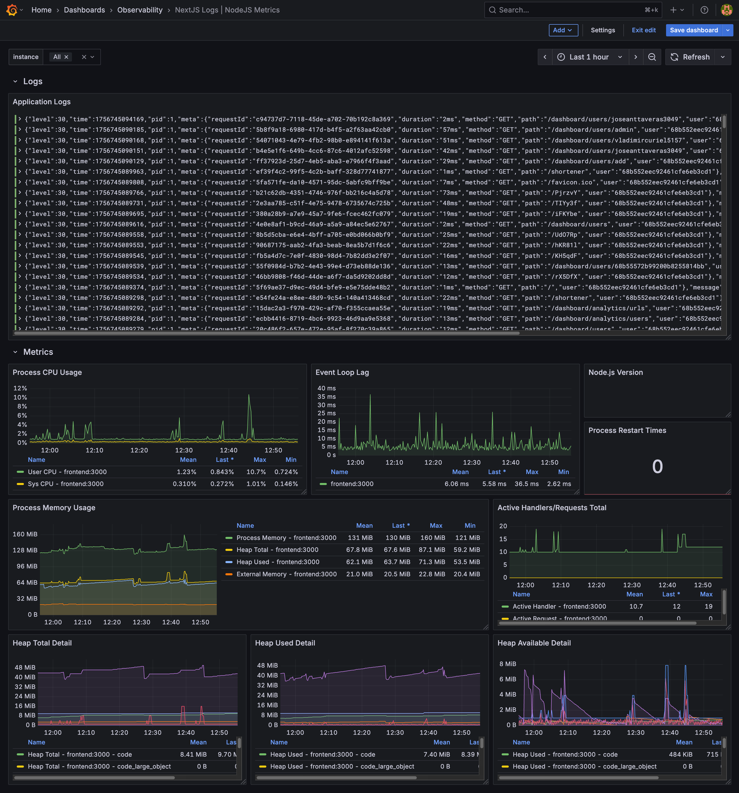
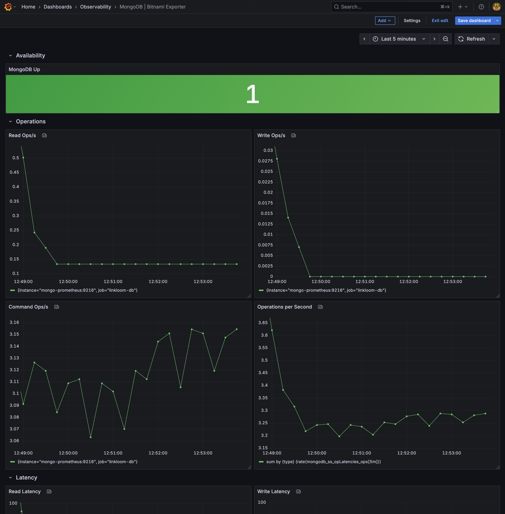
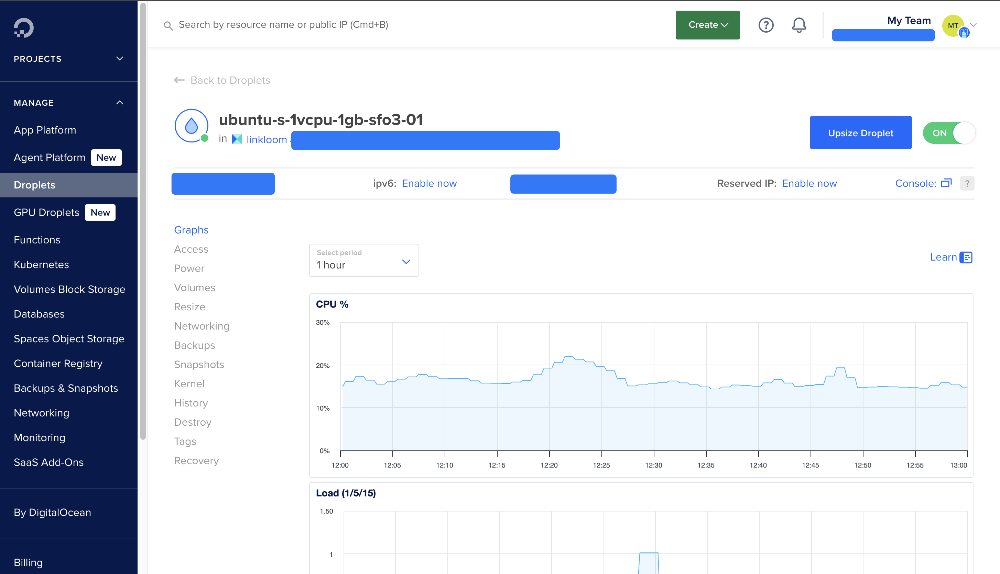
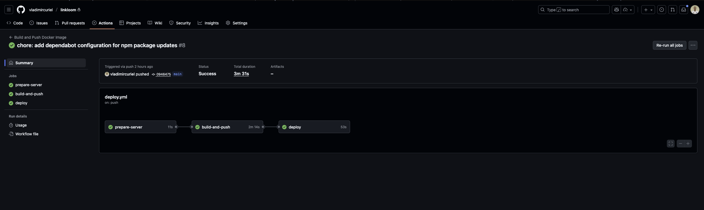

## Visitar
Para visitar la aplicación en línea, puedes hacer clic [aquí](https://ll.o5d.dev/) o en la imagen de arriba.

# Linkloom Url Shortener

[Linkloom](https://ll.o5d.dev/) es una aplicación web para acortar urls, generar códigos QR y recolectar sus estadísticas. Permite a los usuarios registrarse, iniciar sesión y gestionar sus urls acortadas, esta ultima disponible para usuarios registrados. La aplicación también ofrece estadísticas de las visitas a las urls acortadas a los usuarios en el panal principal. Los usuarios puede buscar y filtrar sus urls acortadas, asimismo como navegar entre páginas de resultados.

### Listado Funcionalidades principales para usuarios

- Acortar urls
- Generar códigos QR para las urls acortadas
- Recolectar estadísticas de las visitas a las urls acortadas
- Registro e inicio de sesión de usuarios
- Gestión de urls acortadas (listar, buscar, filtrar, paginar)

#### Anexos

- Filtros

- QR

#### Alcance y limitaciones

- La aplicación está diseñada para ser utilizada por usuarios registrados, por lo que no permite el acortamiento de urls para usuarios no registrados.
- La aplicación no permite la personalización de las urls acortadas, es decir, los usuarios no pueden elegir el alias de la url acortada.
- La aplicación no permite la eliminación de las urls acortadas, una vez creada, la url acortada permanecerá en la base de datos.
- La aplicación no permite la edición de las urls acortadas, una vez creada, la url acortada no puede ser modificada.
- La aplicación valida si la url es valido, pero no la seguridad de la misma, por lo que no se recomienda acortar urls de sitios web maliciosos.

## Panel Administrador

El panel para los administradores permite gestionar los usuarios registrados en la aplicación. Los administradores pueden listar, buscar, filtrar y paginar los usuarios registrados y editarlos. Además, pueden eliminar usuarios registrados. Asi mismo pueden ver las estadísticas de las visitas a las urls acortadas por todos los usuarios registrados, tiene capacidad para desactivar la redirection a las urls acortadas, en caso de que se detecte que una url acortada es maliciosa. Cuenta con metricas de uso de la aplicación, como el número de usuarios registrados, el número de urls acortadas, el número de visitas a las urls acortadas, a la pagina, entre otras.

### Listado Funcionalidades principales para administradores

- Gestión de usuarios registrados (listar, buscar, filtrar, paginar, eliminar, editar)
- Ver estadísticas de las visitas a las urls acortadas por todos los usuarios registrados
- Desactivar la redirection a las urls acortadas
- Ver métricas de uso de la aplicación

#### Alcance y limitaciones

- La aplicación está diseñada para ser utilizada por administradores, por lo que no permite el acceso al panel de administración para usuarios no registrados o usuarios registrados que no sean administradores.
- La aplicación no permite la eliminación de los administradores, una vez creado, el administrador no puede ser eliminado desde el panel de administración.

### Mejoras futuras de la aplicación

- Agregar más métodos de autenticación, como Google, Facebook, etc.
- Agregar la opción de personalizar, eliminar, editar las urls acortadas.
- Agregar la opción de notificaciones por correo electrónico para los usuarios registrados.
- Agregar más estadísticas de las visitas a las urls acortadas.
- Agregar más gráficos de las estadísticas de las visitas

## Base de datos

La base de datos expones un panel de administración para gestionar las colecciones de la base de datos. Permite a los administradores listar, buscar, filtrar y paginar los documentos de las colecciones. Además, pueden eliminar documentos de las colecciones. La base de datos también ofrece estadísticas de uso de la base de datos, como el número de documentos en cada colección, el tamaño de la base de datos, entre otras.

## Monitoreo y Logs

La aplicación y la base de datos, cuentan con un sistema de monitoreo y logs para supervisar el rendimiento y la disponibilidad de la aplicación. Utiliza Grafana para visualizar las métricas de la aplicación, como el número de usuarios registrados, el número de urls acortadas, el número de visitas a las urls acortadas, entre otras. Utiliza Loki para almacenar y consultar los logs de la aplicación. Utiliza Prometheus para recolectar las métricas de la aplicación.

### Monitoreo de la aplicación

Cuenta con un panel de monitoreo para supervisar el rendimiento y la disponibilidad de la aplicación. Permite a los administradores ver las métricas de la aplicación, como el número de usuarios registrados, el número de urls acortadas, el número de visitas a las urls acortadas, entre otras. Además, pueden ver las métricas de uso de la aplicación, como el uso de CPU, memoria, disco, entre otras.

### Monitoreo de la base de datos

Cuenta con un panel de monitoreo para supervisar el rendimiento y la disponibilidad de la base de datos. Permite a los administradores ver las métricas de la base de datos, como el número de documentos en cada colección, el tamaño de la base de datos, entre otras. Además, pueden ver las métricas de uso de la base de datos, como el uso de CPU, memoria, disco, entre otras.

## Despliegue

La aplicación está desplegada en un servidor privado virtual (VPS) en DigitalOcean. Utiliza Docker para contenerizar la aplicación y la base de datos. Utiliza Traefik como proxy inverso para gestionar las solicitudes HTTP y HTTPS. Utiliza GitHub Actions para automatizar el proceso de despliegue de la aplicación y la base de datos.

### Servidor VPS en DigitalOcean

### GitHub Actions

Se cuenta con un flujo de trabajo en GitHub Actions para automatizar el proceso de despliegue de la aplicación y la base de datos. El flujo de trabajo se ejecuta cada vez que se realiza un push en la rama main del repositorio. El flujo de trabajo construye las imágenes Docker de la aplicación y la base de datos, las sube a Docker Hub y despliega las imágenes en el servidor VPS en DigitalOcean.

Cuenta con 3 etapas:

- Prepare server: Valida la conexión SSH con el servidor VPS en DigitalOcean, verifica que docker se encuentra instalado y el directorio del proyecto existe.
- Build and push: Construye las imágenes Docker de la aplicación y la base de datos, las etiqueta y las sube a Docker Hub.
- Deploy: Se conecta al servidor VPS en DigitalOcean, detiene y elimina los contenedores Docker existentes de la aplicación y la base de datos, descarga las nuevas imágenes Docker de Docker Hub y crea y ejecuta los nuevos contenedores Docker de la aplicación y la base de datos.

## Tecnologías utilizadas

- [NextJS](https://nextjs.org/)
- [MongoDB](https://www.mongodb.com/)
- [Mongoose](https://mongoosejs.com/)
- [TailwindCSS](https://tailwindcss.com/)
- [React](https://react.dev/)
- [JavaScript](https://developer.mozilla.org/en-US/docs/Web/JavaScript)
- [TypeScript](https://www.typescriptlang.org/)
- [ReCharts](https://recharts.org/en-US/)
- [Grafana](https://grafana.com/)
- [Loki](https://grafana.com/oss/loki/)
- [Prometheus](https://prometheus.io/)
- [Docker](https://www.docker.com/)
- [DigitalOcean](https://www.digitalocean.com/)
- [Traefik](https://traefik.io/)
- [GitHub Actions](https://github.com/features/actions)

## Autores

### Versión 2.0.0 - NextJS

- [Vladimir Curiel](https://vladimircuriel.com/) - Desarrollador principal

### Versión 1.0.0 - Javalin

- [Vladimir Curiel](https://vladimircuriel.com/) - Co-desarrollador
- [Natasha Lopez](https://www.linkedin.com/in/natasha-lop-b22845337/) - Co-desarrolladora

### Repositorio de GitHub

::github{repo="vladimircuriel/linkloom"}