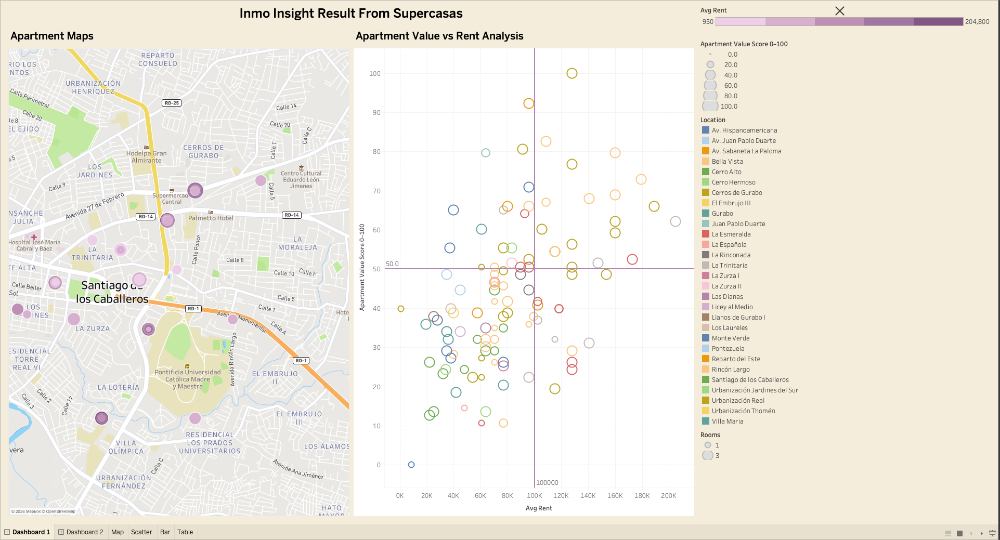
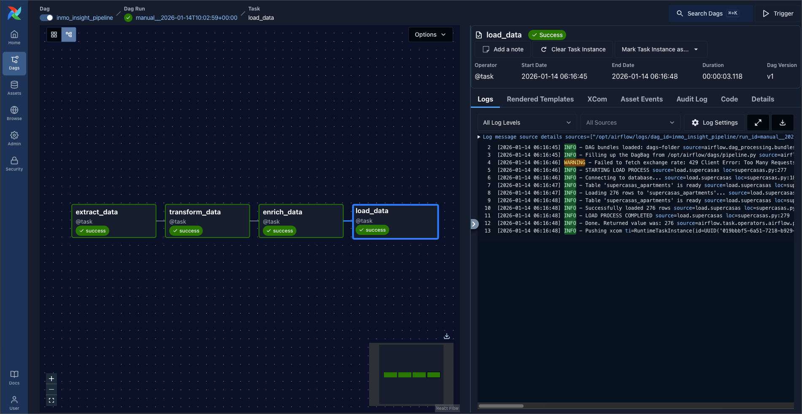
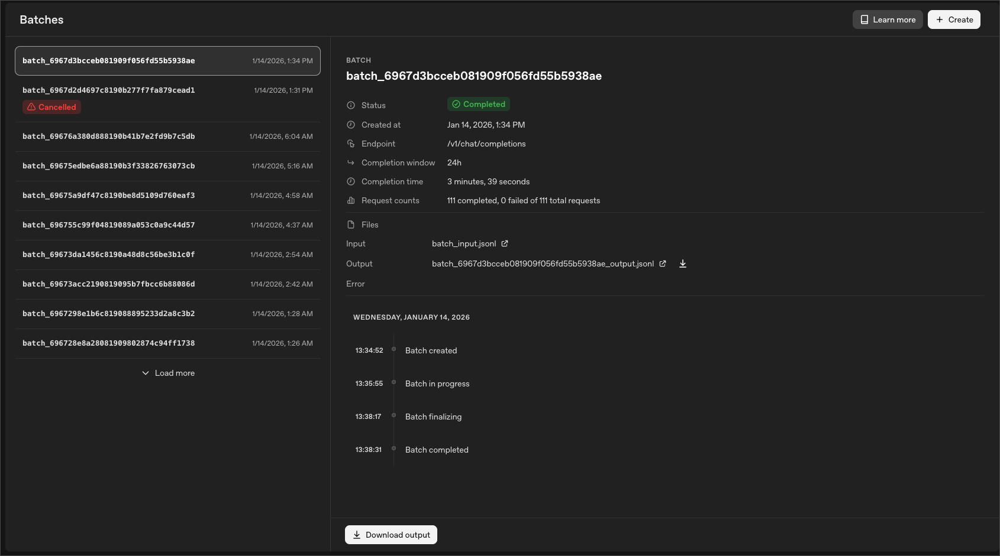
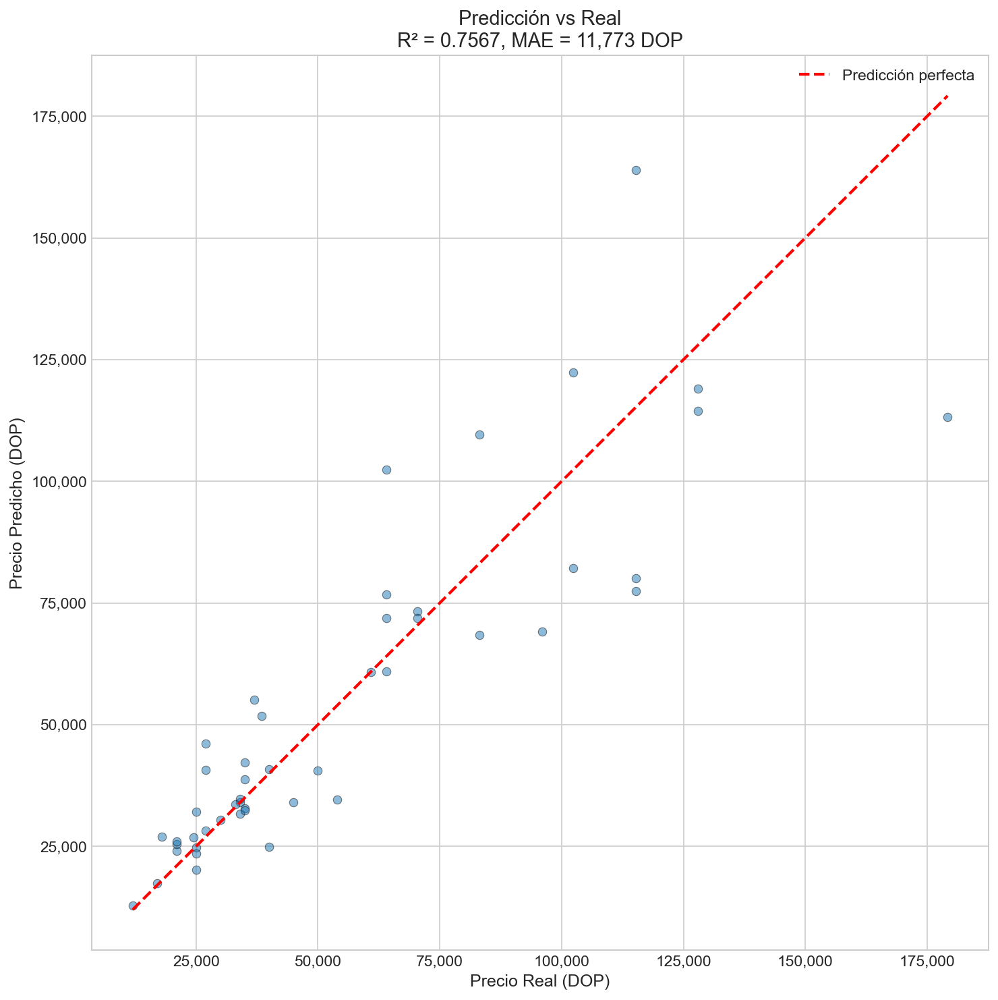
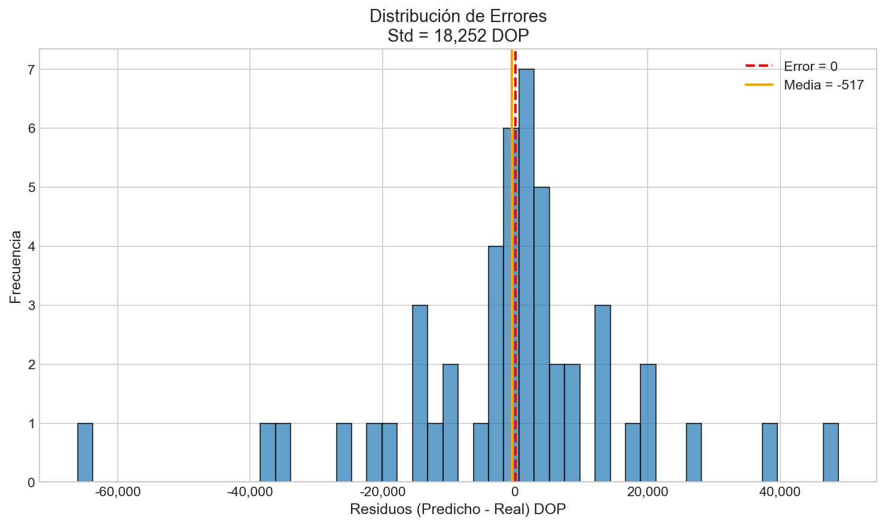
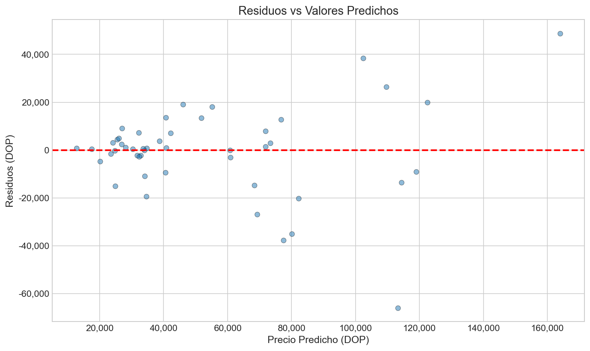
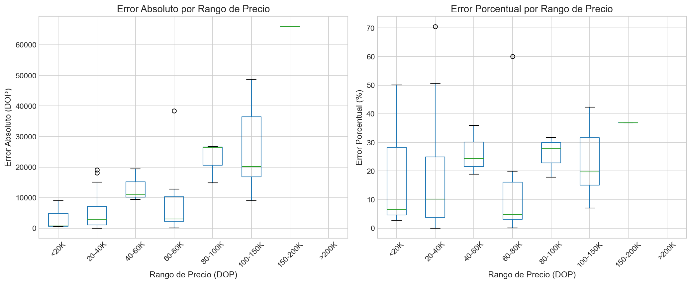
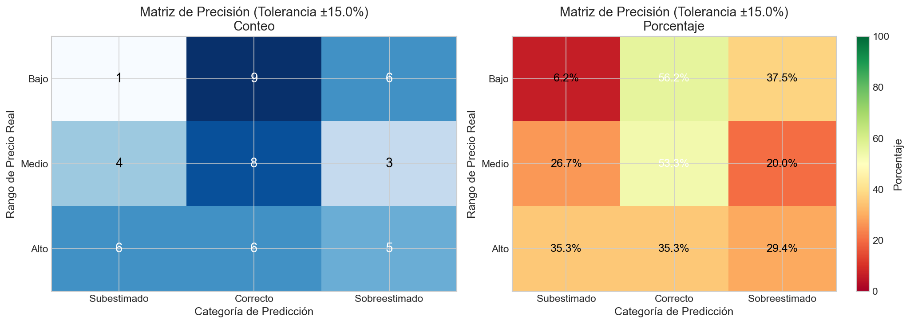
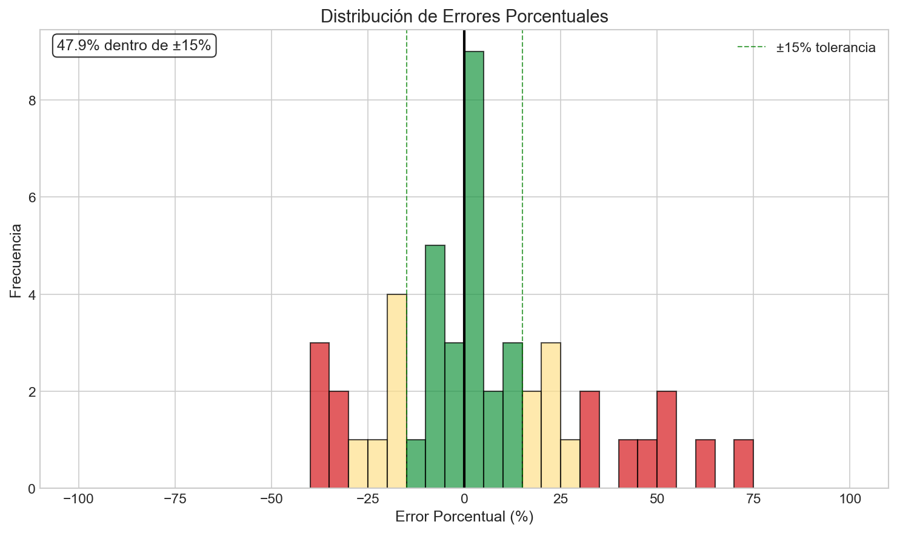
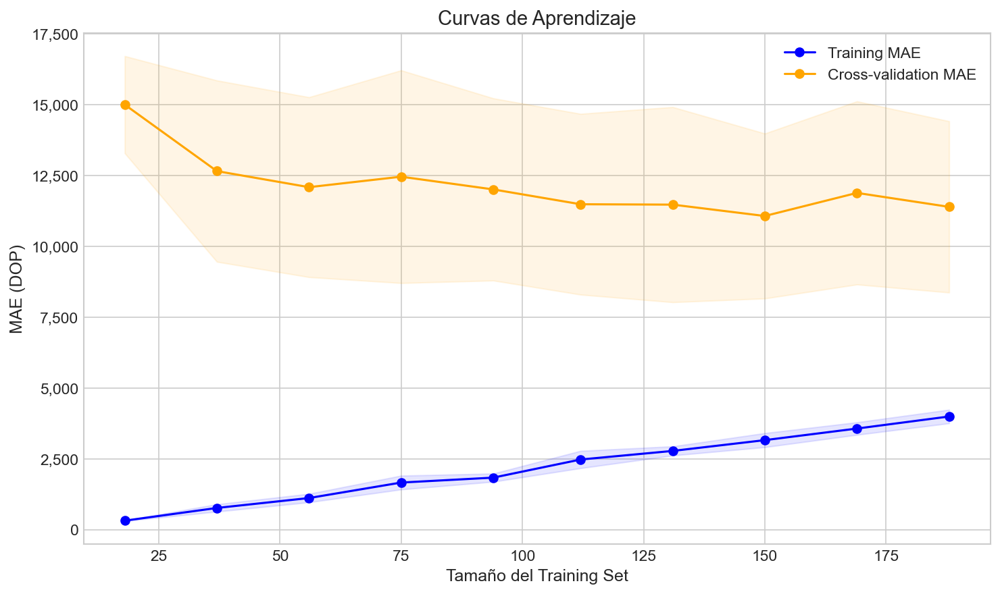

[](public.tableau.com/app/profile/vladimir.curiel3109/viz/inmo-insight/Dashboard1)

## Visitar
Para ver el dashboard en línea, entra [aquí](https://public.tableau.com/app/profile/vladimir.curiel3109/viz/inmo-insight/Dashboard1) o haz clic en la imagen de arriba.

# InmoInsight - Housing Market Data-Driven Analysis

**InmoInsight** es un proyecto de ingeniería de datos end-to-end que combina web scraping, procesamiento ETL, enriquecimiento con inteligencia artificial, y machine learning para analizar el mercado de alquiler de apartamentos en República Dominicana. El proyecto incluye un pipeline orquestado con Apache Airflow, un modelo predictivo de precios con XGBoost, y visualizaciones interactivas en Tableau.

## Visión General del Proyecto

El objetivo principal es extraer insights valiosos del mercado inmobiliario mediante:
- **Extracción automatizada**: Web scraping de listados de apartamentos desde supercasas.com
- **Transformación y limpieza**: Normalización de datos, conversión de unidades, manejo de valores faltantes
- **Enriquecimiento con IA**: Uso de OpenAI Batch API para extraer características adicionales del texto libre
- **Predicción de precios**: Modelo XGBoost para estimar precios de alquiler basado en características
- **Visualización**: Dashboard interactivo en Tableau para análisis exploratorio

### Flujo del Pipeline



```
Extract → Transform + Enrich (OpenAI) → Load
```

## Arquitectura del Sistema

### 1. Pipeline ETL con Apache Airflow

El pipeline está orquestado con Airflow y ejecuta las siguientes etapas cada 2 semanas:

#### **Extract Stage**
- Web scraping con BeautifulSoup y requests
- Extracción de ~200 listados de apartamentos por ejecución
- Datos crudos: precio, habitaciones, baños, ubicación, características, descripciones

#### **Transform Stage**
- Limpieza y normalización de datos
- Conversión de monedas (USD → DOP)
- Extracción de valores numéricos de texto
- Manejo de valores faltantes
- Conversión de tipos de datos

#### **Enrich Stage**
- Preparación de batches JSONL para OpenAI
- Enriquecimiento con GPT para extraer:
  - Conflictos en datos (validación cruzada)
  - Características no estructuradas (cuarto de servicio, walk-in closet)
  - Normalización de ubicaciones
  - Extracción de valores mencionados en texto libre



#### **Load Stage**
- Carga a PostgreSQL con SQLAlchemy
- Estrategia de reemplazo de datos
- Validación de integridad

### 2. Modelo Predictivo de Alquiler

El modelo utiliza **XGBoost Regressor** para predecir precios de alquiler con las siguientes características:

#### Feature Engineering
```python
# Características numéricas
- rooms, baths, parking
- construction_meters, floor
- amount_of_elevators, amount_of_facilities

# Características derivadas
- price_per_sqm (precio por metro cuadrado)
- total_rooms (habitaciones + baños)
- amenities_score (suma de amenidades booleanas)
- is_high_floor (piso >= 5)
- is_new (basado en previous_owners)

# Características categóricas (Label Encoded)
- location (ubicación del apartamento)
- origin_currency (moneda original)

# Características booleanas
- has_pool, has_gym, has_terrace
- security_24_7, service_room, walk_in_closet
- full_power_plant, water_cistern
- y más...
```

#### Métricas del Modelo



```json
{
  "mae": 11,773 DOP (~$196 USD),
  "rmse": 18,259 DOP (~$304 USD),
  "r2": 0.757,
  "mape": 19.79%
}
```

**Interpretación:**
- **R² = 0.757**: El modelo explica el 75.7% de la varianza en precios
- **MAE**: Error promedio de ~$196 USD por predicción
- **MAPE**: Error porcentual promedio del 19.79%

#### Distribución de Residuos



Los residuos siguen una distribución aproximadamente normal, lo que indica un buen ajuste del modelo.



#### Importancia de Features


Las características más influyentes:
1. **construction_meters** - Tamaño del apartamento
2. **location** - Ubicación geográfica
3. **rooms** - Número de habitaciones
4. **amenities_score** - Cantidad de amenidades
5. **floor** - Piso del apartamento

#### Análisis de Errores



El modelo tiene menor error en rangos de precio medio (15,000-40,000 DOP) y mayor error en propiedades premium (>80,000 DOP).





#### Curvas de Aprendizaje



Las curvas de entrenamiento y validación convergen, indicando que el modelo no presenta overfitting significativo.

### 3. Tecnologías y Stack

**Orquestación y ETL:**
- Apache Airflow (TaskFlow API)
- Python 3.13
- Docker Compose

**Extracción:**
- BeautifulSoup4
- Requests
- HTML parsing

**Procesamiento:**
- Pandas
- NumPy

**Enriquecimiento:**
- OpenAI API (GPT-5-nano)
- Batch API para procesamiento eficiente

**Almacenamiento:**
- PostgreSQL
- SQLAlchemy

**Machine Learning:**
- XGBoost
- Scikit-learn
- Joblib

**Visualización:**
- Matplotlib
- Tableau Desktop

## Funcionalidades Principales

### Pipeline ETL Automatizado
- Ejecución programada cada 2 semanas
- Manejo robusto de errores y reintentos
- Logging detallado en cada etapa
- Validación de datos en cada paso
- Containerización con Docker

### Enriquecimiento con IA
- Batch processing para eficiencia de costos
- Validación cruzada de datos estructurados vs. texto
- Extracción de características no estructuradas
- Normalización de ubicaciones y valores

### Modelo Predictivo
- Feature engineering automatizado
- Grid search para optimización de hiperparámetros
- Validación cruzada
- Persistencia de modelos y encoders
- API de predicción lista para producción

### Visualización de Resultados
- 8 gráficas de evaluación del modelo
- Dashboard interactivo en Tableau
- Análisis exploratorio de datos
- Visualización de distribuciones y outliers

## Dashboard en Tableau

<div class='tableauPlaceholder' id='viz1768439595134' style='position: relative'><noscript><a href='#'></a></noscript><object class='tableauViz'  style='display:none;'><param name='host_url' value='https%3A%2F%2Fpublic.tableau.com%2F' /> <param name='embed_code_version' value='3' /> <param name='site_root' value='' /><param name='name' value='inmo-insight&#47;Dashboard1' /><param name='tabs' value='no' /><param name='toolbar' value='yes' /><param name='static_image' value='https:&#47;&#47;public.tableau.com&#47;static&#47;images&#47;in&#47;inmo-insight&#47;Dashboard1&#47;1.png' /> <param name='animate_transition' value='yes' /><param name='display_static_image' value='yes' /><param name='display_spinner' value='yes' /><param name='display_overlay' value='yes' /><param name='display_count' value='yes' /><param name='language' value='en-US' /></object></div>                <script type='text/javascript'> 
var divElement = document.getElementById('viz1768439595134');                    
var vizElement = divElement.getElementsByTagName('object')[0];
if (divElement.offsetWidth > 800) { vizElement.style.width='100%'; vizElement.style.height=(divElement.offsetWidth*0.75)+'px'; }
else if (divElement.offsetWidth > 500) { vizElement.style.width='100%'; vizElement.style.height=(divElement.offsetWidth*0.75)+'px'; }
else { vizElement.style.width='100%'; vizElement.style.height='2627px'; }
var scriptElement = document.createElement('script');
scriptElement.src = 'https://public.tableau.com/javascripts/api/viz_v1.js';
vizElement.parentNode.insertBefore(scriptElement, vizElement);
</script>

El dashboard interactivo incluye:

- **Mapa de calor por ubicación**: Visualización geográfica de precios promedio
- **Distribución de precios**: Histogramas y box plots por sector
- **Análisis de amenidades**: Correlación entre características y precio
- **Tendencias temporales**: Evolución de precios en el tiempo
- **Comparativa de sectores**: Rankings por ubicación
- **Filtros interactivos**: Por precio, habitaciones, ubicación, amenidades

<!--  -->

## Casos de Uso

### 1. Inversores Inmobiliarios
- Identificar zonas con mejor relación calidad-precio
- Predecir retorno de inversión en alquileres
- Analizar tendencias del mercado

### 2. Agentes Inmobiliarios
- Valoración automática de propiedades
- Recomendaciones de precios competitivos
- Análisis de portafolio de propiedades

### 3. Inquilinos
- Detectar ofertas por debajo del mercado
- Comparar opciones basadas en características
- Entender qué amenidades justifican precios más altos

## Resultados del Modelo

### Configuración Óptima (Grid Search)
```python
{
  "max_depth": 3,
  "learning_rate": 0.1,
  "n_estimators": 100,
  "subsample": 0.9,
  "colsample_bytree": 1.0,
  "objective": "reg:squarederror"
}
```

### Ejemplo de Predicción

```python
from model.predict import RentPredictor

predictor = RentPredictor()

# Apartamento de ejemplo
apartment = {
    "rooms": 3,
    "baths": 2,
    "parking": 2,
    "construction_meters": 150,
    "floor": 7,
    "location": "Bella Vista",
    "has_pool": True,
    "has_gym": True,
    "security_24_7": True,
    "amount_of_elevators": 2,
    # ... más características
}

predicted_rent = predictor.predict(apartment)
print(f"Precio estimado: {predicted_rent:,.0f} DOP")
# Output: Precio estimado: 45,230 DOP
```

## Desafíos y Soluciones

### 1. Calidad de Datos
**Problema:** Datos inconsistentes, valores faltantes, formatos diversos  
**Solución:** Pipeline robusto de limpieza + validación con IA

### 2. Extracción de Características
**Problema:** Información relevante en texto libre no estructurado  
**Solución:** OpenAI Batch API para extracción inteligente

### 3. Ubicaciones No Estandarizadas
**Problema:** Misma ubicación con múltiples nombres  
**Solución:** Normalización con IA + geolocalización

### 4. Costos de API
**Problema:** Llamadas individuales a OpenAI muy costosas  
**Solución:** Batch API reduce costos en 50%

## Mejoras Futuras

### Pipeline
- Agregar más fuentes de datos (otros portales inmobiliarios)
- Implementar data versioning con DVC
- Agregar tests automatizados con Great Expectations
- Monitoreo con Prometheus + Grafana

### Modelo
- Experimentar con LightGBM y CatBoost
- Implementar ensemble models
- Agregar features de geolocalización (distancia a puntos de interés)
- Incorporar datos históricos para análisis de tendencias
- Implementar model monitoring y drift detection

### Enriquecimiento
- Análisis de sentimiento en descripciones
- Extracción de imágenes y clasificación con CV
- Scoring de calidad de anuncios

### Dashboard
- Integrar con API REST para consultas

## Aprendizajes Clave

1. **ETL robusto es fundamental**: La calidad del modelo depende directamente de la calidad de los datos
2. **Batch processing ahorra costos**: 50% de reducción en costos de API usando batches
3. **Feature engineering > algoritmos complejos**: Buenas características importan más que el modelo en sí
4. **Validación cruzada con IA**: Usar LLMs para validar y enriquecer datos estructurados
5. **Visualización comunica insights**: Gráficas bien diseñadas facilitan la toma de decisiones

## Repositorio

::github{repo="vladimircuriel/inmo-insight"}

## Autor

- [Vladimir Curiel](https://vladimircuriel.com/) - Desarrollador
