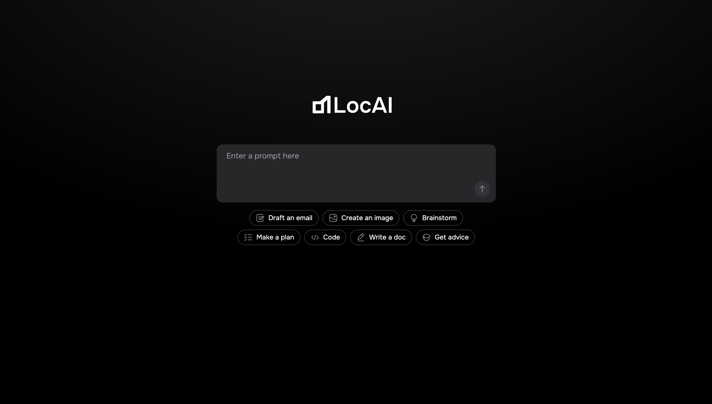
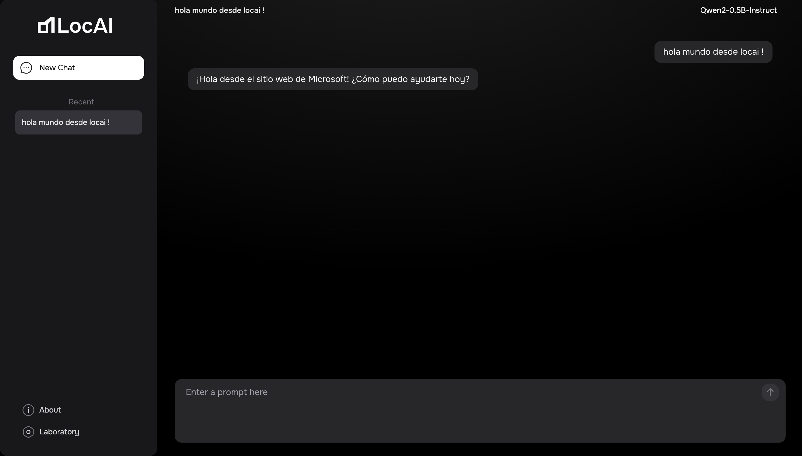
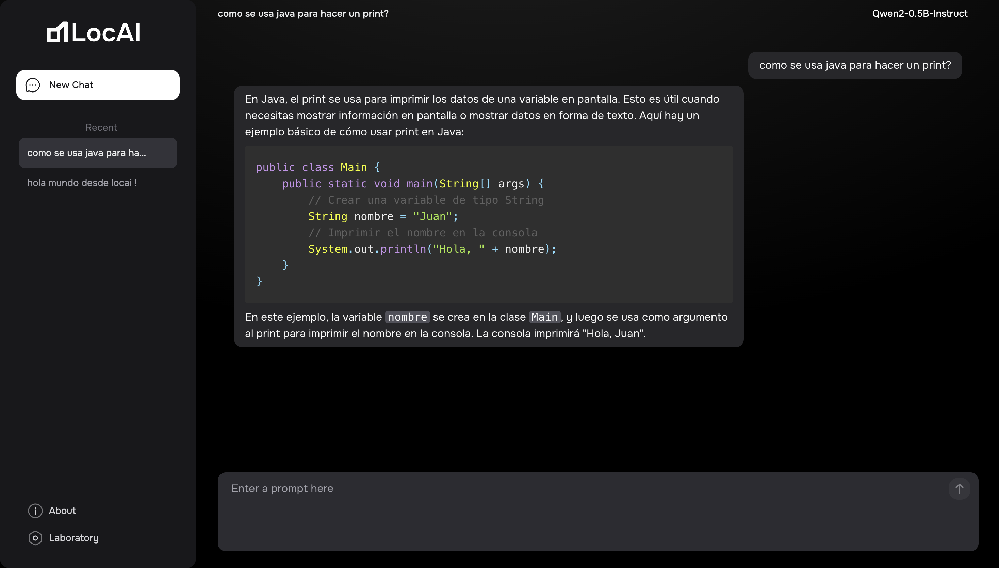
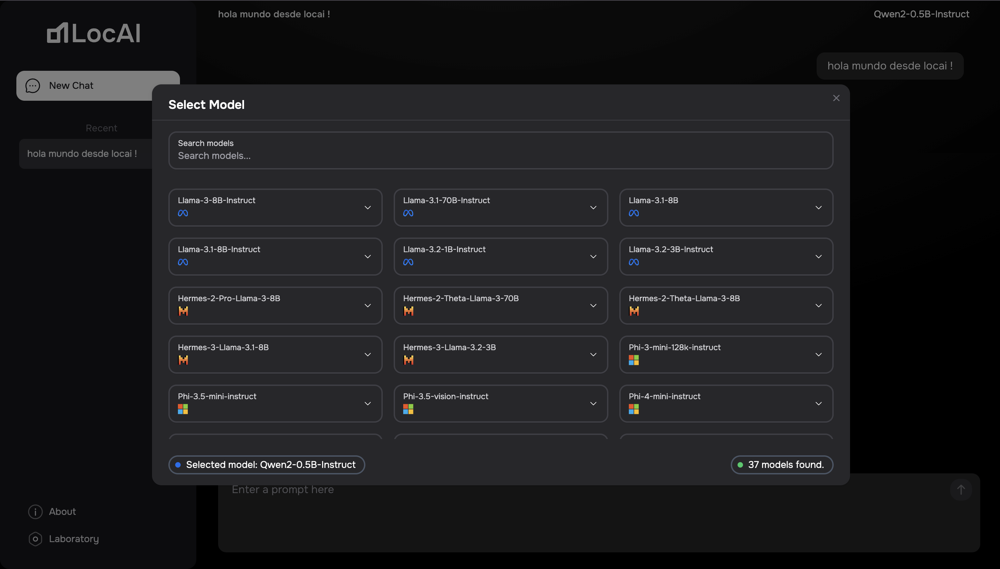
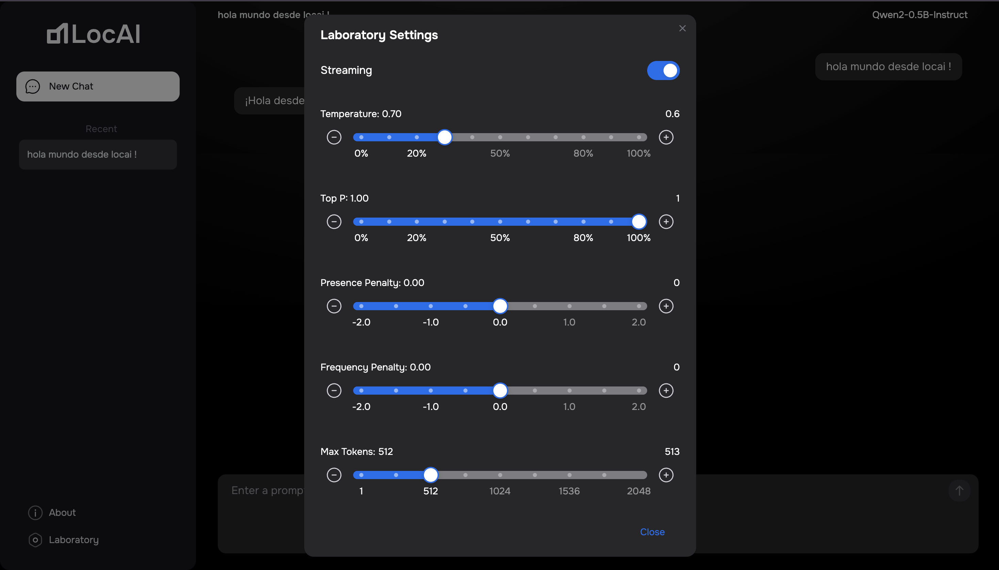
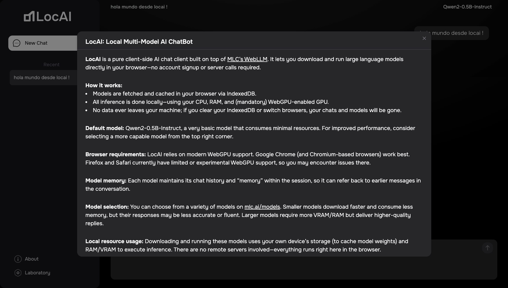
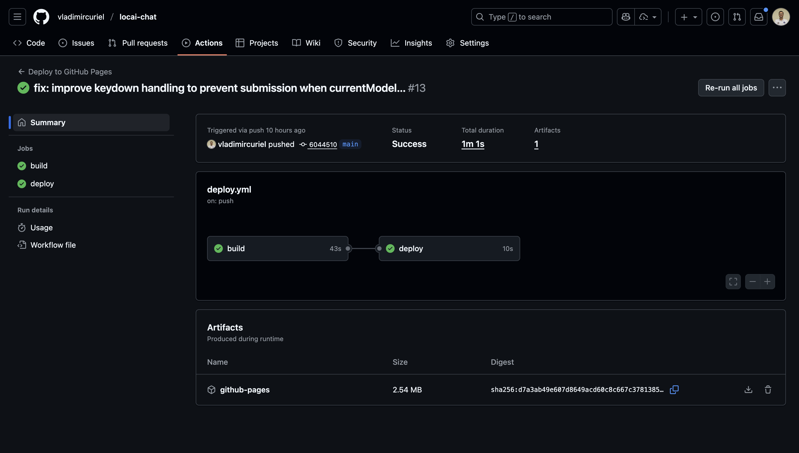

## Visitar
Para visitar la aplicación en línea, puedes hacer clic [aquí](https://locai.o5d.dev/) o en la imagen de arriba.

# LocAI Chat

[LocAI Chat](https://locai.o5d.dev/) es una aplicación web de chat con múltiples modelos de lenguaje grande (LLM) que se ejecutan completamente en el navegador. No requiere cuentas ni llamadas a API remotas, lo que garantiza una inferencia segura y privada en tu dispositivo.

### Listado de funcionalidades

- Inferencia del lado del cliente: Descarga y ejecuta LLMs a través de WebGPU para un rendimiento acelerado por GPU.
- Soporte para múltiples modelos: Navega, selecciona y cambia entre docenas de modelos de MLC-AI (por ejemplo, Qwen2, Llama-3, Phi-3, Gemma-2).
- Enfoque sin conexión: El Service Worker almacena en caché los activos y pesos del modelo para que puedas chatear sin conexión.
- Chats persistentes: Las conversaciones y configuraciones se almacenan en IndexedDB; tu historial y el modelo usado por última vez persisten entre recargas.
- Transmisión en tiempo real: Las respuestas parciales se transmiten con actualizaciones en vivo y bloques de código autoformateados.
- Controles avanzados: Deslizadores con marcas, pasos, tooltips y botones de incremento/decremento para temperatura, top-p, penalizaciones, límites de tokens y conteo de opciones.
- Aplicación WebGPU: Bloquea navegadores no compatibles (Firefox, Safari) y te guía a Chrome/Chromium con WebGPU habilitado.
- Interfaz de usuario moderna: Componentes personalizados de React/Tailwind, modales responsivos para Información, Selección de Modelo, Configuraciones Avanzadas y errores de WebGPU.

#### Anexos

- Chat

- Formateo de Código

- Modelos

- Configuraciones Avanzadas

- Acerca de

#### Alcance y limitaciones

- La aplicación está diseñada para ser utilizada en navegadores compatibles con WebGPU, como Chrome o Chromium. No es compatible con Firefox o Safari.
- La aplicación depende de la capacidad de tu dispositivo para ejecutar modelos de lenguaje grande (LLM). Los dispositivos con hardware limitado pueden experimentar un rendimiento reducido.
- La aplicación no almacena datos en servidores remotos, por lo que todas las conversaciones y configuraciones se almacenan localmente en tu dispositivo.
- La aplicación no ofrece integración con servicios de terceros ni importación de conversaciones.
- La aplicación no permite la personalización de los modelos más allá de los parámetros expuestos en la interfaz de usuario.
- La aplicación no ofrece soporte para modelos personalizados fuera de los disponibles en MLC-AI.

## Despliegue

Se cuenta con un flujo de trabajo en GitHub Actions para automatizar el proceso de despliegue de la aplicación. El flujo de trabajo se ejecuta cada vez que se realiza un push en la rama main del repositorio. El flujo de trabajo construye el build de la aplicación y lo despliega en GitHub Pages.

## Tecnologías utilizadas

- [Astro](https://astro.build/)
- [React](https://react.dev/)
- [TypeScript](https://www.typescriptlang.org/)
- [TailwindCSS](https://tailwindcss.com/)
- [WebLLM](https://github.com/mlc-ai/web-llm)
- [WebGPU](https://www.w3.org/TR/webgpu/)
- [IndexedDB](https://developer.mozilla.org/en-US/docs/Web/API/IndexedDB_API)
- [ServiceWorker](https://developer.mozilla.org/en-US/docs/Web/API/Service_Worker_API)
- [GitHub Actions](https://github.com/features/actions)

## Autores

### Versión 2.0.0 - Astro

- [Vladimir Curiel](https://vladimircuriel.com/) - Desarrollador principal

### Versión 1.0.0 - NextJS

- [Vladimir Curiel](https://vladimircuriel.com/) - Desarrollador principal

### Repositorio de GitHub

::github{repo="vladimircuriel/locai-chat"}