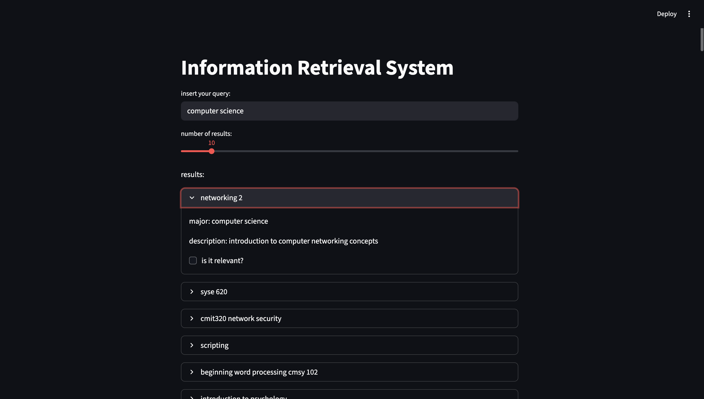

# Classes Information Retrieval System

**Classes Information Retrieval System** es un motor de recuperación de información local escrito en Python que:

- Indexa colecciones de documentos (cualquier columna de un DataFrame de pandas) usando TF-IDF.
- Aplica un pipeline NLP (tokenización, lematización, eliminación de stop-words) para refinar las consultas.
- Mide la similitud coseno entre la consulta y el corpus para devolver resultados relevancia-ordenados en milisegundos.
- Permite configurar el número de resultados top-N y muestra metadatos (ID, título, descripción limpia, puntuación de relevancia).
- Ofrece persistencia del índice y del vectorizador en memoria o en disco para búsquedas subsecuentes instantáneas.
- Es agnóstico al esquema de datos: basta apuntar al DataFrame y la columna deseada.
- Diseñado para extenderse a algoritmos más avanzados (BM25, embeddings neuronales).

### Funcionalidades principales para usuarios

- **Indexación local**: construye el índice TF-IDF al inicializar, sin dependencias externas.  
- **Pipeline NLP personalizado**: `query_processing()` gestiona tokenización, normalización y lematización.  
- **Búsqueda rápida**: vectores TF-IDF + similitud de coseno para respuestas en milisegundos.  
- **Ranking Top-N**: resultados ordenados por puntuación, con metadatos útiles.  
- **Persistencia opcional**: guarda y reutiliza el vectorizador e índice para consistencia entre ejecuciones.  
- **Extensible**: fácil integración de BM25 u otros métodos de ranking.

#### Alcance y limitaciones

- Requiere recursos de CPU/RAM adecuados para conjuntos de datos grandes; no optimizado para Big Data.
- No integra búsquedas semánticas con embeddings modernos, aunque es posible extenderlo.
- No incluye interfaz web propia; se basa en Streamlit para demostración.
- No soporta clustering ni clasificación automática de documentos.

## Repositorio

::github{repo="vladimircuriel/information-retrieval-system"}