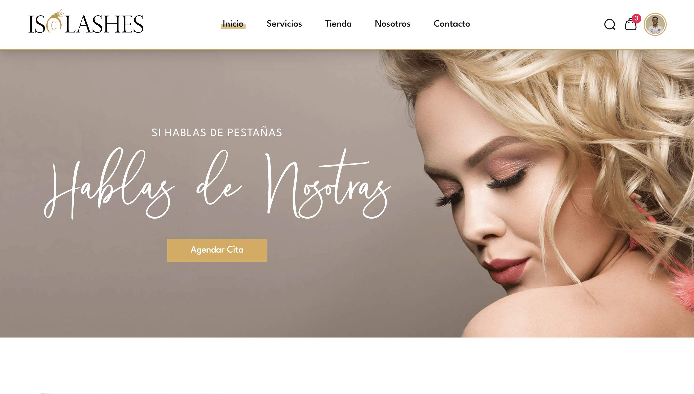

# Isolashes V1

**Isolashes** es un salón de belleza especializado en extensiones de pestañas, asi como también es una tienda de productos de belleza y academia de formación en extensiones de pestañas. Para esta empresa desarrollé dos web apps.

## Landing Page

### Listado de funcionalidades para usuarios

- **Página de inicio**: Presenta la marca, servicios destacados y llamada a la acción para reservar citas.
- **Página de servicios**: Detalla todos los servicios ofrecidos con descripciones y precios.
- **Página de tienda**: Catálogo de productos con imágenes, descripciones y precios.
- **Carrito de compras**: Permite a los usuarios agregar productos, ver el total y proceder al pago.
- **Página de contacto**: Formulario para que los usuarios puedan enviar consultas o solicitar información.
- **Sistema de reservas**: Los usuarios pueden seleccionar servicios, elegir fechas y horarios disponibles, y confirmar citas.
- **Autenticación de usuarios**: Registro e inicio de sesión para gestionar reservas y compras con Google o email.
- **Panel de usuario**: Los usuarios pueden ver y gestionar sus reservas, historial de compras y detalles de perfil.
- **Diseño responsivo**: La web app está optimizada para funcionar bien en dispositivos móviles y de escritorio.
- **SEO básico**: Implementación de prácticas básicas de SEO para mejorar la visibilidad en motores de búsqueda.
- **Integración de pagos**: Pasarela de pago segura para procesar transacciones en línea.

### Demo de la landing page

<iframe width="100%" height="500" src="https://www.youtube.com/embed/k5-RDm2OTKs?si=XDZ_w-8KG6kdrw3i" title="YouTube video player" frameborder="0" allow="accelerometer; autoplay; clipboard-write; encrypted-media; gyroscope; picture-in-picture; web-share" referrerpolicy="strict-origin-when-cross-origin" allowfullscreen></iframe>

## Dashboard de Administrador

### Listado de funcionalidades para administradores

- **Gestión de servicios**: Añadir, editar o eliminar servicios ofrecidos en el salón.
- **Gestión de productos**: Añadir, editar o eliminar productos en la tienda.
- **Gestión de reservas**: Ver, confirmar, cancelar o reprogramar citas de clientes.
- **Gestión de usuarios**: Ver y gestionar la lista de usuarios registrados, incluyendo roles y permisos.
- **Gestión de pedidos**: Ver y gestionar los pedidos realizados en la tienda, incluyendo estado y detalles.
- **Gestión de inventario**: Controlar el stock de productos disponibles en la tienda
- **Panel de control**: Vista general con estadísticas clave como número de reservas, ventas y usuarios activos.
- **Autenticación y autorización**: Acceso seguro al dashboard solo para administradores.

### Demo del dashboard de administrador

<iframe width="100%" height="500" src="https://www.youtube.com/embed/bU9_606o5Xs?si=LitPkQVSnH4NA8BV" title="YouTube video player" frameborder="0" allow="accelerometer; autoplay; clipboard-write; encrypted-media; gyroscope; picture-in-picture; web-share" referrerpolicy="strict-origin-when-cross-origin" allowfullscreen></iframe>

## Integración del panel de administrador con la landing page

Aquí se muestra la integración de la landing con el dashboard, donde se puede ver la actualización en tiempo real de los servicios y productos de la empresa.

<iframe width="100%" height="500" src="https://www.youtube.com/embed/WeL7IJxf-0Q?si=aAjf__HfDzA4unvn" title="YouTube video player" frameborder="0" allow="accelerometer; autoplay; clipboard-write; encrypted-media; gyroscope; picture-in-picture; web-share" referrerpolicy="strict-origin-when-cross-origin" allowfullscreen></iframe>

## Listado de tecnologías utilizadas

- NestJS
- Prisma
- ZenStack
- PostgreSQL
- NextAuth
- NextJS
- React
- TailwindCSS

## Mejoras de la V1 a futuras versiones

- Implementar un sistema de notificaciones por correo electrónico para confirmaciones de reservas y actualizaciones de pedidos.
- Añadir un sistema de reseñas y valoraciones para servicios y productos.
- Integrar un sistema de chat en vivo para soporte al cliente.
- Mejorar la optimización SEO para aumentar la visibilidad en motores de búsqueda.
- Añadir funcionalidades de marketing, como cupones de descuento y promociones especiales.
- Implementar análisis avanzados y reportes para el dashboard de administrador.
- Mejorar la accesibilidad para cumplir con las normas WCAG.
- Añadir soporte para múltiples idiomas en la landing page y el dashboard.
- Optimizar el rendimiento de la web app para tiempos de carga más rápidos.
- Implementar pruebas automatizadas para asegurar la calidad del código y la funcionalidad.
