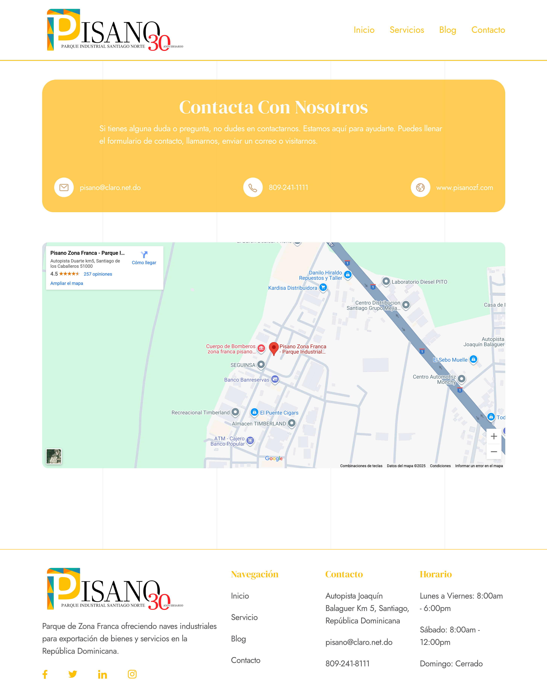
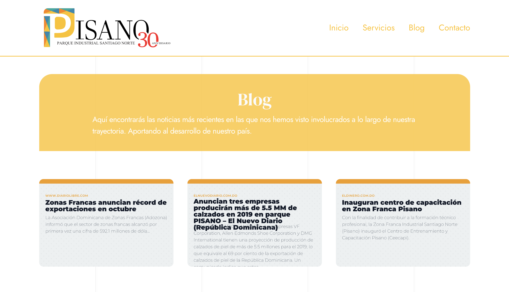
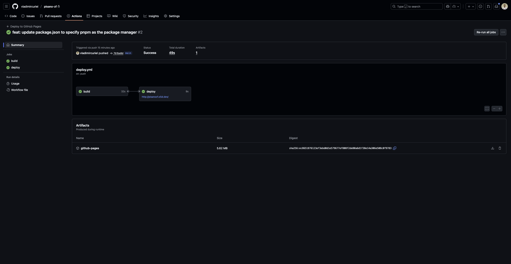

## Visitar
Para visitar la página en línea, puedes hacer clic [aquí](https://pisanozf.o5d.dev/) o en la imagen de arriba.

# Pisano Zona Franca

[Pisano Zona Franca](https://pisanozf.o5d.dev/). El Parque Industrial Santiago Norte (PISANO) fundado en el año 1989, es un proyecto privado, compuesto por una Zona Franca de Exportación y una Zona Industrial Nacional. Provee mecanismos de exportación para la manufactura y ensamblaje de productos y servicios.

Es una reconstrucción de la página web de la empresa Pisano Zona Franca, la cual fue creada en [Wix](https://pisanozf.com). Utilizando la nueva linea gráfica de la empresa

### Listado de paginas

- **Página de inicio**: Presenta la marca, servicios destacados y llamada a la acción para contactar a la empresa.
- **Página de servicios**: Detalla todos los servicios ofrecidos con descripciones.
- **Página de contacto**: Formulario para que los usuarios puedan enviar consultas o solicitar información.
- **Página de Noticias**: Sección para publicar noticias y actualizaciones relacionadas con la empresa.

#### Anexos

- Página de inicio

- Página de servicios

- Página de contacto

- Página de noticias

## Listado de tecnologías

- Astro
- React
- TailwindCSS
- GitHub Actions

## Despliegue

Se cuenta con un flujo de trabajo en GitHub Actions para automatizar el proceso de despliegue de la aplicación. El flujo de trabajo se ejecuta cada vez que se realiza un push en la rama main del repositorio. El flujo de trabajo construye el build de la aplicación y lo despliega en GitHub Pages.