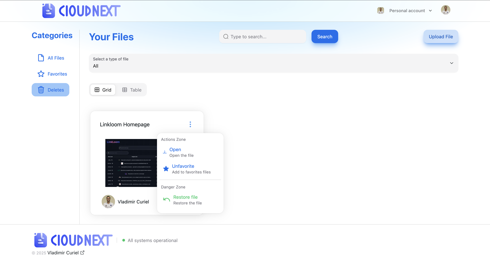
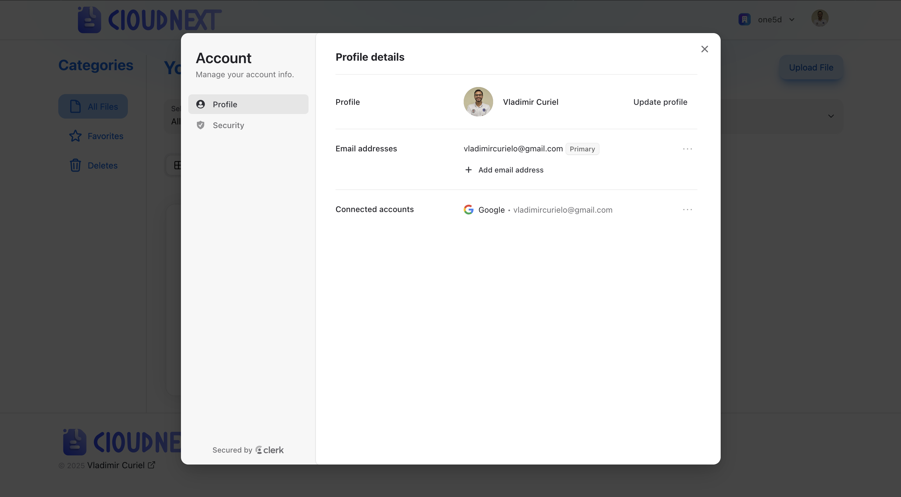
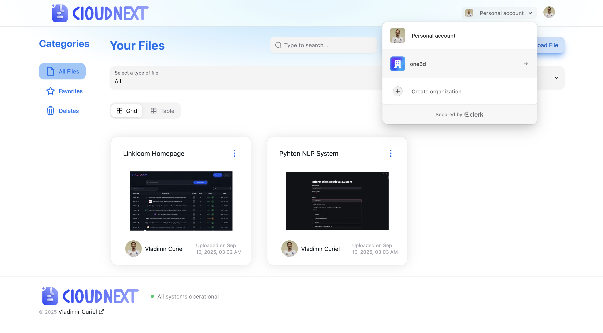
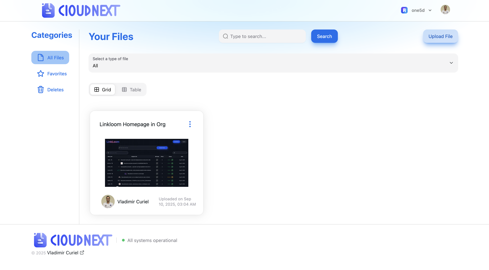
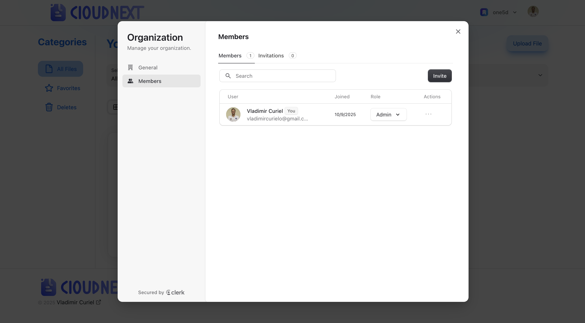
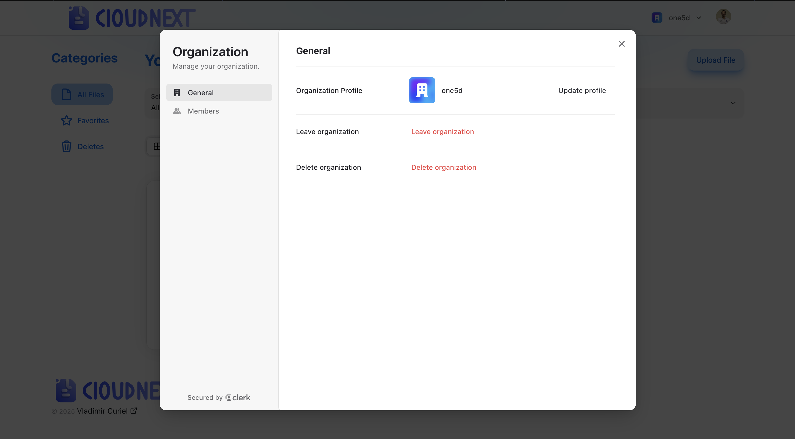
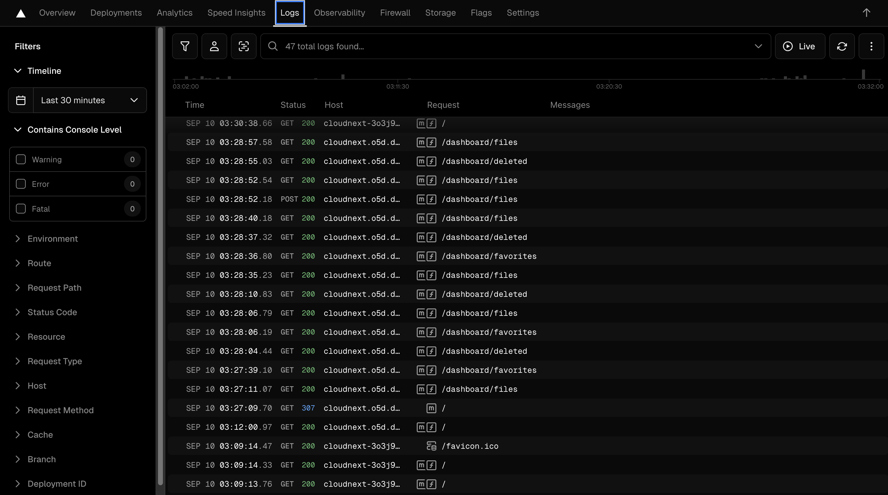
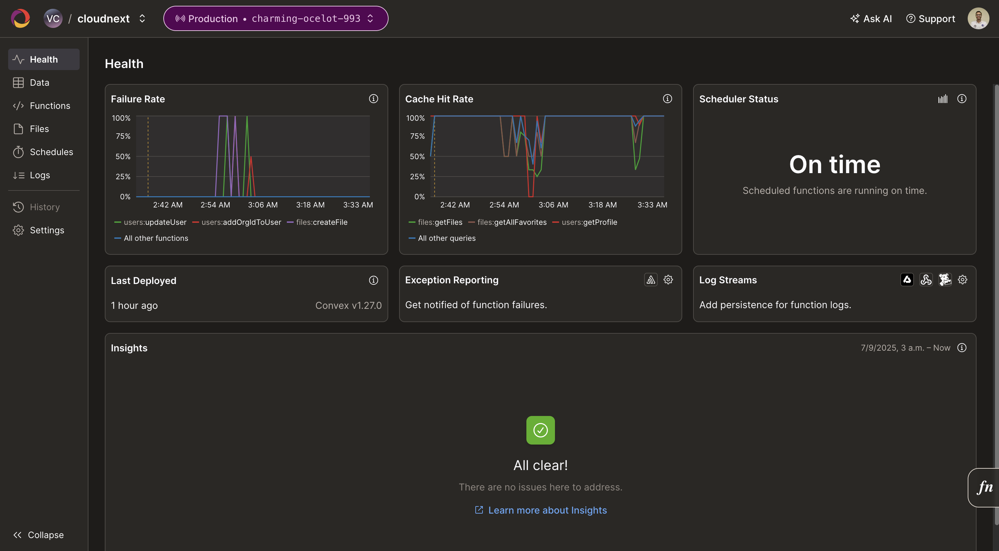
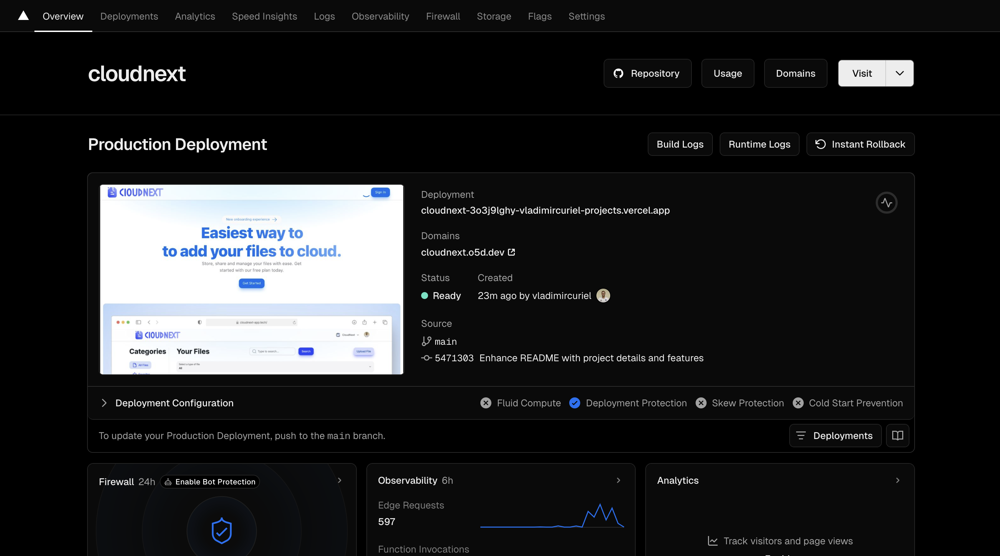
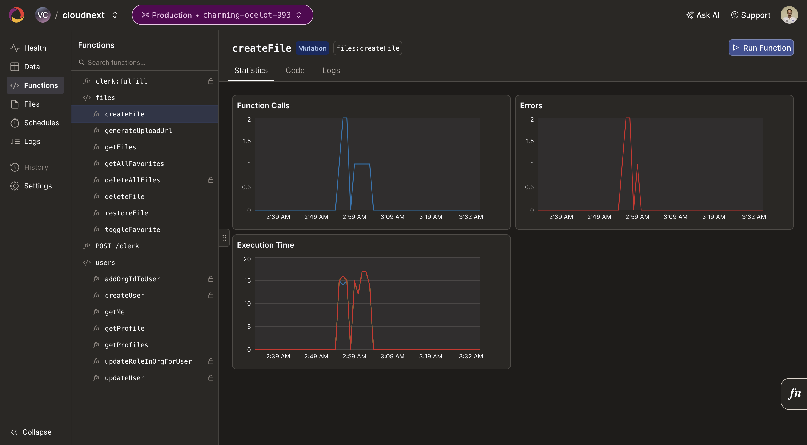

## Visitar
Para visitar la aplicación en línea, puedes hacer clic [aquí](https://cloudnext.o5d.dev/) o en la imagen de arriba.

# CloudNext

[CloudNext](https://cloudnext.o5d.dev/) es una aplicación web para almacenar y compartir archivos en la nube de manera sencilla y segura. Permite a los usuarios registrarse, iniciar sesión y gestionar sus archivos almacenados. La aplicación ofrece funcionalidades como subir, descargar, eliminar y compartir archivos. Los usuarios pueden buscar y filtrar sus archivos, así como navegar entre páginas de resultados.

### Listado de funcionalidades usuarios

- Subir archivos (documentos, CSVs, imágenes)
- Descargar archivos
- Eliminar archivos
- Compartir archivos mediante enlaces
- Buscar y filtrar archivos
- Navegar entre páginas de resultados

#### Anexos

- Archivos

- Favoritos

- Deleted

- Cuenta

- Organización

- Organización Archivos

- Organización Usuarios

- Organización Configuración

#### Alcance y limitaciones

- Los archivos no pueden ser renombrados después de la subida; los usuarios solo ven el nombre de archivo original.
- No hay un sistema de carpetas o etiquetas; los archivos se listan en una estructura plana, lo que puede volverse difícil de gestionar a gran escala.
- Aunque las organizaciones soportan permisos basados en roles, solo los administradores pueden eliminar archivos; no están disponibles roles más específicos (por ejemplo, solo lectura, solo subida).
- Los archivos eliminados van a un área de eliminación pendiente de 30 días, pero la recuperación solo es posible dentro de ese período; después de eso, se pierden permanentemente.
- Cualquier usuario con la URL directa del archivo puede acceder al archivo, lo que significa que controles de acceso más estrictos o características de expiración de enlaces podrían mejorar la privacidad.
- Los archivos se almacenan en S3 sin cifrado en reposo, dejando el contenido visible en forma plana a nivel de almacenamiento.
- No hay un sistema de versiones, por lo que actualizar un archivo requiere subir una nueva copia.
- Los usuarios no pueden ver su historial de actividad (subidas, descargas, eliminaciones), y las organizaciones carecen de paneles de análisis para monitorear el uso.

## Monitoreo y Logs

La aplicación utiliza Convex para el backend y la base de datos, que proporciona monitoreo y logs integrados. Además, se utiliza Vercel para monitorear el rendimiento y el uso de la aplicación en el frontend. Los logs de errores y eventos importantes se almacenan en Convex, lo que permite rastrear y solucionar problemas de manera eficiente.

- Frontend Logs

- Backend Logs

## Despliegue

La aplicación está desplegada en Vercel, que ofrece un entorno de producción escalable y seguro. El despliegue se realiza automáticamente mediante GitHub Actions cada vez que se realiza un push a la rama principal del repositorio. Esto garantiza que la aplicación esté siempre actualizada con los últimos cambios y mejoras.

- Vercel

Para el backend y la base de datos, se utiliza Convex, que proporciona un entorno gestionado para ejecutar funciones de backend y almacenar datos. Convex maneja automáticamente el escalado y la disponibilidad, lo que permite centrarse en el desarrollo de la aplicación sin preocuparse por la infraestructura subyacente.

- Convex

## Tecnologías utilizadas

- [NextJS](https://nextjs.org/)
- [React](https://react.dev/)
- [TailwindCSS](https://tailwindcss.com/)
- [Clerk](https://clerk.com/)
- [Convex](https://convex.dev/)
- [TypeScript](https://www.typescriptlang.org/)
- [Vercel](https://vercel.com/)
- [GitHub Actions](https://github.com/features/actions)

## Autor

### Versión 2.0.0 - NextJS 15

- [Vladimir Curiel](https://vladimircuriel.com/) - Desarrollador principal

### Versión 1.0.0 - NextJS 13

- [Vladimir Curiel](https://vladimircuriel.com/) - Desarrollador principal

### Repositorio de GitHub

::github{repo="vladimircuriel/cloudnext"}

