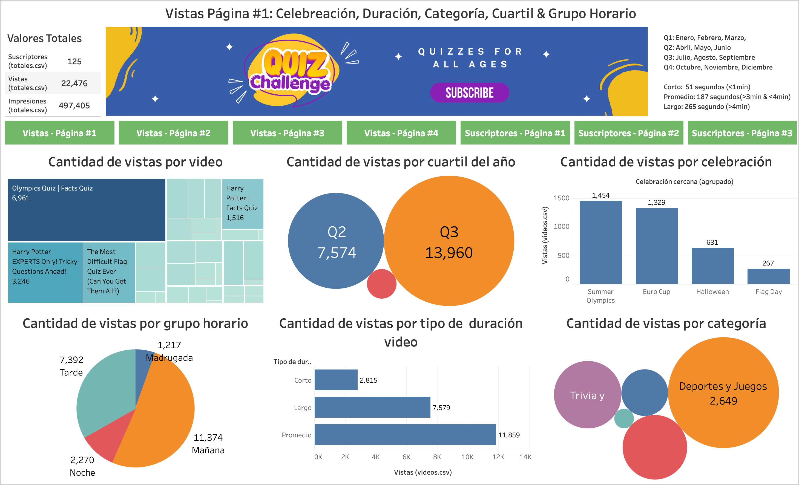

## Visitar
Para ver el dashboard en línea, entra [aquí](https://public.tableau.com/app/profile/vladimir.curiel/viz/TheQuizChallenge-YouTubeChannel/Vistas-Pgina1) o haz clic en la imagen de arriba.

# The Quiz Challenge – Dashboard Interactivo

Este proyecto combina minería de datos descriptiva con un modelo de clustering y un dashboard interactivo en Tableau. Su objetivo es ayudar al canal de YouTube **The Quiz Challenge** a identificar patrones en métricas clave (vistas, comentarios, suscripciones, likes/dislikes) y tomar decisiones más precisas sobre qué contenido crear.

### Fuente de datos
- Dataset original exportado desde YouTube: vistas, suscriptores, comentarios, likes/dislikes.
- Archivos agrupados por tipo de métrica en carpetas separadas.
- Investigación de fuentes externas para enriquecer datos (demografía, keywords en tendencia).

### Dashboard en Tableau
- ETL realizado en **Tableau Prep**: unión de fuentes, limpieza, campos calculados (cuartiles, grupos horarios).
- Visualizaciones interactivas:
  - Líneas de tiempo de vistas y suscripciones.
  - Histogramas por duración y categoría.
  - Filtros por cuartil de vistas, grupo horario y cluster.
  - Panel de detalle por video con métricas y etiquetas.
- Publicado en Tableau Public para acceso de stakeholders.

### Modelo descriptivo con clusters
- **Entorno:** Python 3 en Jupyter Notebook.
- **Preprocesamiento:** tokenización con NLTK, eliminación de stopwords, lematización.
- **Vectorización:** TF-IDF para texto; normalización para métricas numéricas.
- **Algoritmos:** K-Means (selección de k con curva de codo y silhouette), validación con DBSCAN.
- **Evaluación:** Silhouette Score, Davies–Bouldin, análisis de cohesión vs separación.

## Tecnologías utilizadas

- **Visualización:** Tableau Desktop & Public
- **Análisis y modelado:** Python, Jupyter Notebook, Pandas, NumPy, Scikit-Learn, NLTK

## Desarrollo del proyecto

1. **Exploración inicial**  
   - Carga de CSVs.
   - Revisión de calidad y formatos de datos.

2. **ETL en Tableau Prep**  
   - Unión y limpieza.
   - Creación de campos derivados.
   - Exportación de extractos `.hyper`.

3. **Modelado en Python**  
   - Preprocesamiento de texto.
   - Vectorización TF-IDF.
   - K-Means y validación con métricas.
   - PCA para visualización 2D de clusters.

4. **Dashboard final**  
   - Conexión a datos procesados.
   - Creación de hojas y diseño final con acciones de filtro.
   - Publicación en Tableau Public.

## Dashboard Interactivo

<noscript></noscript><object class='tableauViz'  style='display:none;'><param name='host_url' value='https%3A%2F%2Fpublic.tableau.com%2F' /> <param name='embed_code_version' value='3' /> <param name='site_root' value='' /><param name='name' value='TheQuizChallenge-YouTubeChannel&#47;Vistas-Pgina1' /><param name='tabs' value='no' /><param name='toolbar' value='yes' /><param name='static_image' value='https:&#47;&#47;public.tableau.com&#47;static&#47;images&#47;Th&#47;TheQuizChallenge-YouTubeChannel&#47;Vistas-Pgina1&#47;1.png' /> <param name='animate_transition' value='yes' /><param name='display_static_image' value='yes' /><param name='display_spinner' value='yes' /><param name='display_overlay' value='yes' /><param name='display_count' value='yes' /><param name='language' value='en-US' /></object>
                

## Listado de tecnologías utilizadas

- [Tableau](https://www.tableau.com/)
- [Python](https://www.python.org/)
- [Jupyter Notebook](https://jupyter.org/)
- [Scikit-Learn](https://scikit-learn.org/)
- [NLTK](https://www.nltk.org/)
- [YouTube API](https://developers.google.com/youtube/v3)

## Autores

- [Vladimir Curiel](https://vladimircuriel.com/) - Co-desarrollador
- [Natasha Lopez](https://www.linkedin.com/in/natasha-lop-b22845337/) - Co-desarrolladora